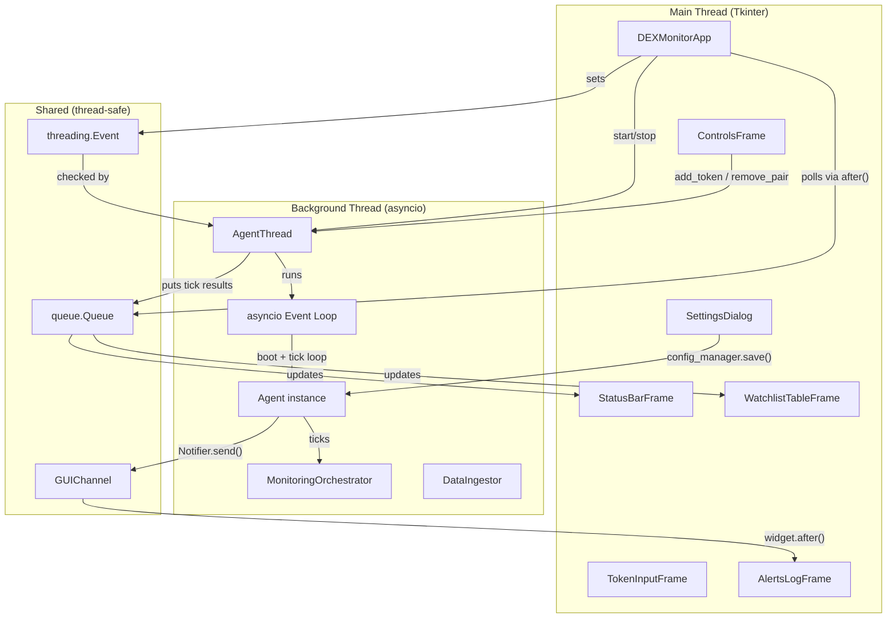
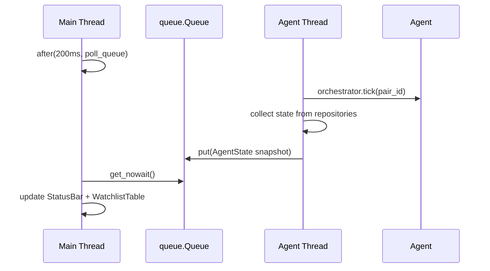

# Design Document: DEX GUI

## Overview

The DEX GUI is a desktop application that wraps the existing DEX Trading Agent with a modern dark-mode graphical interface built on CustomTkinter. It enables users to monitor token watchlists, view alerts, manage agent lifecycle (start/stop), and configure thresholds — all without touching the CLI.

The GUI runs as a separate entry point (`python -m dex_agent.gui`) and integrates with the agent by:
1. Constructing the same `Agent` instance used by the CLI (via `build_production_agent`)
2. Running the agent's asyncio tick loop in a dedicated daemon thread (`Agent_Thread`)
3. Routing alerts to the GUI via a new `GUIChannel` that implements the existing `NotificationChannel` interface
4. Communicating state updates from the background thread to the Tkinter main thread using `widget.after()` scheduling

No existing source files are modified; all new code lives in `dex_agent/gui/`.

## Architecture



### Key Architectural Decisions

1. **Daemon thread with asyncio loop**: The agent is async-ready (uses `await` in some paths). Running `asyncio.run()` inside a daemon thread lets us reuse the exact CLI tick loop without modification.

2. **Queue-based state transfer**: A `queue.Queue` carries serialized state snapshots (dataclass dicts) from the agent thread to the GUI. The main thread polls this queue every 200ms via `widget.after()`, avoiding lock contention on widget access.

3. **GUIChannel injection via `channels` list**: The existing `AgentProviders.channels` field accepts a list of `NotificationChannel` instances. The GUI entry point appends a `GUIChannel` to this list before calling `build_production_agent`, requiring zero changes to `Notifier` or any existing module.

4. **No modification to existing files**: All code lives in `dex_agent/gui/`. The entry point imports `HttpxClient`, `SolanaRpcClient`, and `NoOpSigner` from `dex_agent/__main__` rather than re-declaring them.

## Components and Interfaces

### Module Structure

```
dex_agent/gui/
├── __init__.py          # Package marker
├── __main__.py          # Entry point: python -m dex_agent.gui
├── app.py               # DEXMonitorApp (root CTk window)
├── thread.py            # AgentThread (background daemon)
├── channel.py           # GUIChannel (NotificationChannel impl)
├── frames/
│   ├── __init__.py
│   ├── status_bar.py    # StatusBarFrame
│   ├── watchlist.py     # WatchlistTableFrame
│   ├── token_input.py   # TokenInputFrame
│   ├── alerts_log.py    # AlertsLogFrame
│   └── controls.py      # ControlsFrame (Start/Stop/Settings)
└── dialogs/
    ├── __init__.py
    └── settings.py      # SettingsDialog (modal)
```

### Component Interfaces

#### DEXMonitorApp (`app.py`)

```python
class DEXMonitorApp(customtkinter.CTk):
    """Root application window. Owns all frames and the AgentThread."""

    def __init__(self, agent: Agent) -> None: ...
    def start_agent(self) -> None: ...
    def stop_agent(self) -> None: ...
    def on_closing(self) -> None: ...
    def _poll_state_queue(self) -> None: ...
    def _update_ui_state(self, state: AgentState) -> None: ...
```

#### AgentThread (`thread.py`)

```python
@dataclass(frozen=True)
class AgentState:
    """Snapshot of agent state pushed to the GUI each tick."""
    active_pairs: int
    uptime_seconds: float
    last_tick_time: str | None
    alerts_count: int
    watchlist_rows: list[WatchlistRow]
    is_running: bool
    error: str | None = None

@dataclass(frozen=True)
class WatchlistRow:
    """One row of watchlist table data."""
    pair_id: str
    token_name: str
    severity: str
    bot_pct: str
    liquidity: str
    signal_type: str
    signal_score: str

class AgentThread:
    """Manages the background daemon thread running the agent loop."""

    def __init__(self, agent: Agent, state_queue: queue.Queue, gui_channel: GUIChannel) -> None: ...
    def start(self) -> None: ...
    def request_stop(self) -> None: ...
    def is_running(self) -> bool: ...
    def is_transitioning(self) -> bool: ...
    def submit(self, fn: Callable) -> None: ...  # schedule work on agent thread
```

#### GUIChannel (`channel.py`)

```python
class GUIChannel(NotificationChannel):
    """Routes alerts to the Alerts_Log widget via thread-safe scheduling."""

    def __init__(self, alerts_log_widget: AlertsLogFrame | None = None) -> None: ...
    def set_widget(self, widget: AlertsLogFrame) -> None: ...
    def deliver(self, alert: Alert) -> Result[DeliveryResult]: ...
```

#### StatusBarFrame (`frames/status_bar.py`)

```python
class StatusBarFrame(customtkinter.CTkFrame):
    """Horizontal bar showing active pairs, uptime, last tick, alert count."""

    def update_state(self, state: AgentState) -> None: ...
    def _tick_uptime(self) -> None: ...  # 1-second uptime counter
```

#### WatchlistTableFrame (`frames/watchlist.py`)

```python
class WatchlistTableFrame(customtkinter.CTkFrame):
    """Tabular display of monitored tokens using CTkTreeview or scrollable frame."""

    def update_rows(self, rows: list[WatchlistRow]) -> None: ...
    def get_selected_pair_id(self) -> str | None: ...
```

#### TokenInputFrame (`frames/token_input.py`)

```python
class TokenInputFrame(customtkinter.CTkFrame):
    """Mint address input + Add/Remove buttons."""

    def __init__(self, master, on_add: Callable[[str], None], on_remove: Callable[[], None]) -> None: ...
    def set_enabled(self, enabled: bool) -> None: ...
    def clear_input(self) -> None: ...
```

#### AlertsLogFrame (`frames/alerts_log.py`)

```python
class AlertsLogFrame(customtkinter.CTkFrame):
    """Scrollable read-only text area for timestamped alert messages."""

    MAX_ENTRIES: int = 10_000

    def append_alert(self, title: str, body: str) -> None: ...
    def append_message(self, message: str) -> None: ...
```

#### SettingsDialog (`dialogs/settings.py`)

```python
class SettingsDialog(customtkinter.CTkToplevel):
    """Modal dialog for editing agent configuration parameters."""

    def __init__(self, master, config_manager: ConfigManager) -> None: ...
    def _save(self) -> None: ...
    def _cancel(self) -> None: ...
```

## Data Models

### AgentState (thread communication DTO)

| Field | Type | Description |
|-------|------|-------------|
| `active_pairs` | `int` | Count from `orchestrator.active_count()` |
| `uptime_seconds` | `float` | Seconds since agent thread started |
| `last_tick_time` | `str \| None` | `HH:MM:SS` of last completed tick |
| `alerts_count` | `int` | Total alerts delivered via GUIChannel |
| `watchlist_rows` | `list[WatchlistRow]` | Current table data |
| `is_running` | `bool` | Whether agent loop is active |
| `error` | `str \| None` | Error message if thread crashed |

### WatchlistRow (table display DTO)

| Field | Type | Source |
|-------|------|--------|
| `pair_id` | `str` | `WatchlistEntry.pair_id` |
| `token_name` | `str` | `Token.name` via `WatchlistEntry` |
| `severity` | `str` | `SecurityEvaluation.rating.name` or `"-"` |
| `bot_pct` | `str` | `WalletAnalysis.bot_pct` formatted or `"-"` |
| `liquidity` | `str` | `PairSnapshot.liquidity` or `"-"` |
| `signal_type` | `str` | `Signal.signal_type.name` or `"-"` |
| `signal_score` | `str` | `Signal.score` formatted or `"-"` |

### Thread Communication Flow




## Correctness Properties

*A property is a characteristic or behavior that should hold true across all valid executions of a system — essentially, a formal statement about what the system should do. Properties serve as the bridge between human-readable specifications and machine-verifiable correctness guarantees.*

### Property 1: Missing environment variable detection

*For any* subset of the required environment variables (MORALIS_API_KEY, SOLANA_RPC_URL, TELEGRAM_BOT_TOKEN, TELEGRAM_CHAT_ID) where at least one variable is missing or empty, the entry point SHALL display an error message naming the specific missing variable and SHALL NOT attempt to construct the agent.

**Validates: Requirements 1.3**

### Property 2: Agent construction/boot exception display

*For any* exception raised during `build_production_agent()` or `agent.boot()`, the GUI SHALL display the exception's message in the Alerts_Log or an error label, and SHALL remain in (or transition to) the stopped state without crashing.

**Validates: Requirements 1.5, 9.6**

### Property 3: Status bar numeric accuracy

*For any* `AgentState` with an `active_pairs` count and `alerts_count`, the Status_Bar SHALL display those exact integer values in their respective labels.

**Validates: Requirements 3.1, 3.4**

### Property 4: Time duration formatting

*For any* non-negative duration in seconds, the status bar's uptime/last-tick formatter SHALL produce a string matching the pattern `HH:MM:SS` where hours may exceed 23, minutes are 00–59, and seconds are 00–59.

**Validates: Requirements 3.2, 3.3**

### Property 5: Watchlist row rendering with missing data

*For any* `WatchlistRow`, the table SHALL render all defined column values (token name, severity, bot pct, liquidity, signal type/score), and for any field that is `None` or unavailable, the table SHALL display the literal string `"-"` in that column.

**Validates: Requirements 4.1, 4.6**

### Property 6: Watchlist row ordering preservation

*For any* list of `WatchlistRow` items passed to the table's `update_rows` method, the displayed rows SHALL appear in the same sequential order as the input list (insertion order from `WatchlistRepository.list_active()`).

**Validates: Requirements 4.7**

### Property 7: Add token workflow correctness

*For any* non-empty, non-whitespace-only mint address string entered in the Token_Input, clicking Add SHALL invoke `agent.add_token(mint_address, Network.SOLANA)` with that exact string. If the result is Ok, the input field SHALL be cleared to empty. If the result is Err, the error's message SHALL be appended to the Alerts_Log and the input text SHALL be preserved unchanged.

**Validates: Requirements 5.2, 5.3, 5.5**

### Property 8: Whitespace input rejection

*For any* string composed entirely of whitespace characters (including empty string), clicking the Add button SHALL NOT invoke `add_token` and SHALL leave the Token_Input text unchanged.

**Validates: Requirements 5.7**

### Property 9: Alert log entry formatting

*For any* Alert with arbitrary `title` and `body` strings, the appended log entry SHALL match the format `YYYY-MM-DD HH:MM:SS [title] body` where the timestamp reflects the current time at append, title is enclosed in square brackets, and body follows after a space.

**Validates: Requirements 6.1**

### Property 10: Alerts log capacity management

*For any* sequence of alert entries appended to the Alerts_Log, the log SHALL retain at most 10,000 entries. When a new entry is appended and the count is already at 10,000, the oldest entry SHALL be removed before the new entry is appended, maintaining exactly 10,000 entries with the most recent ones preserved.

**Validates: Requirements 6.4, 6.6**

### Property 11: GUIChannel deliver contract

*For any* Alert delivered via `GUIChannel.deliver()`: if the Alerts_Log widget is available, the result SHALL be `Ok(DeliveryResult)` with `channel` set to the GUIChannel's name, `delivered=True`, and `detail=""`. If the widget has been destroyed/is unavailable, the result SHALL be `Ok(DeliveryResult)` with `delivered=False` and a non-empty `detail` string, without raising an exception.

**Validates: Requirements 7.4, 7.6**

### Property 12: Settings dialog fields match PARAM_RANGES

*For any* parameter key defined in `ConfigManager.PARAM_RANGES`, the Settings_Dialog SHALL contain a labeled input field for that parameter with the label matching the parameter name.

**Validates: Requirements 10.2**

### Property 13: Settings dialog pre-population

*For any* active `Configuration` object (or DEFAULTS when active is None), each input field in the Settings_Dialog SHALL be pre-populated with the corresponding parameter's current value.

**Validates: Requirements 10.3**

### Property 14: Settings type coercion on save

*For any* set of valid user-entered numeric values in the Settings_Dialog, the `config_manager.save()` call SHALL receive integer values for integer-typed parameters (those where `ParamRange.integer` is True) and `Decimal` values for decimal-typed parameters (those where `ParamRange.integer` is False).

**Validates: Requirements 10.4**

### Property 15: Settings save error retention

*For any* `ConfigValidationError` or `ConfigPersistenceError` returned by `config_manager.save()`, the Settings_Dialog SHALL display the error's `message` property, SHALL remain open, and SHALL preserve all user-entered values in their respective input fields without modification.

**Validates: Requirements 10.5, 10.6**

### Property 16: Repository failure data retention

*For any* combination of repository call failures during a watchlist refresh cycle, the Watchlist_Table SHALL retain the previously displayed data for the affected columns rather than displaying empty or corrupt values.

**Validates: Requirements 11.5**

## Error Handling

### Entry Point Errors

| Error Condition | Handling |
|----------------|----------|
| Missing env variable | Display error label in main window naming the variable; do not construct agent |
| `build_production_agent()` raises | Display exception message in Alerts_Log; remain in stopped state |
| `agent.boot()` raises | Display exception message in Alerts_Log; transition to stopped state |

### Agent Thread Errors

| Error Condition | Handling |
|----------------|----------|
| Unhandled exception in tick loop | Append error to Alerts_Log; set `AgentState.error`; transition to stopped |
| Thread fails to terminate within 60s | Force-terminate via `thread.join(timeout=60)` fallback; transition to stopped |
| Provider call timeout during tick | Orchestrator handles internally; staleness indicator on affected rows |

### GUI Interaction Errors

| Error Condition | Handling |
|----------------|----------|
| `add_token` returns Err | Append error message to Alerts_Log; retain input text |
| `config_manager.save()` returns Err(ConfigValidationError) | Display validation message in Settings_Dialog; retain entered values |
| `config_manager.save()` returns Err(ConfigPersistenceError) | Display persistence error in Settings_Dialog; retain entered values |
| Remove clicked with no selection | No-op; do nothing |
| Add clicked with empty/whitespace input | No-op; do nothing |

### GUIChannel Errors

| Error Condition | Handling |
|----------------|----------|
| Widget destroyed before delivery | Return `Ok(DeliveryResult(delivered=False, detail="widget unavailable"))` |
| Thread scheduling fails | Catch TclError; return delivered=False without raising |

## Testing Strategy

### Property-Based Testing

**Library**: [Hypothesis](https://hypothesis.readthedocs.io/) (already present in the project's `.hypothesis/` directory)

**Configuration**: Minimum 100 examples per property test (`@settings(max_examples=100)`)

**Tag format**: Each property test tagged with a comment:
```python
# Feature: dex-gui, Property {N}: {property_text}
```

**Properties to implement** (16 total, mapped to design properties above):

| Property | Test Focus | Key Generators |
|----------|-----------|----------------|
| 1 | Env var subsets → error message | `st.sets(st.sampled_from(REQUIRED_VARS))` |
| 2 | Exception types → displayed in GUI | `st.from_type(Exception)` |
| 3 | Numeric state values → correct display | `st.integers(min_value=0)` |
| 4 | Duration seconds → HH:MM:SS format | `st.integers(min_value=0, max_value=360000)` |
| 5 | WatchlistRow with optional fields → rendering | Custom `st.builds(WatchlistRow)` |
| 6 | Row lists → order preserved | `st.lists(st.builds(WatchlistRow))` |
| 7 | Mint address + result → correct workflow | `st.text(min_size=1, max_size=44)` |
| 8 | Whitespace strings → rejection | `st.from_regex(r'^\s*$')` |
| 9 | Alert title/body → format match | `st.text()` pairs |
| 10 | Entry count sequences → capacity limit | `st.integers(min_value=9990, max_value=10100)` |
| 11 | Alert + widget state → correct DeliveryResult | `st.builds(Alert)` + `st.booleans()` |
| 12 | PARAM_RANGES keys → field existence | Exhaustive (fixed set) |
| 13 | Configuration values → pre-population | `st.builds(Configuration)` |
| 14 | Numeric inputs → correct type coercion | `st.decimals()` / `st.integers()` |
| 15 | Error types → dialog retention | `st.builds(ConfigValidationError)` |
| 16 | Failure combinations → data retention | `st.lists(st.booleans(), min_size=4, max_size=4)` |

### Unit Tests (Example-Based)

- Window configuration (dark mode, min size, title)
- Button state transitions (start/stop/transitional)
- Settings Cancel behavior
- Initial status bar state (zeros/empty)
- CLI non-regression (import smoke test)

### Integration Tests

- Full agent thread start → tick → stop lifecycle
- GUIChannel delivery from background thread via `widget.after()`
- Settings save → config applied to next tick cycle
- Watchlist refresh at configured interval

### Test Architecture

Tests live in `tests/gui/` and use:
- `unittest.mock.patch` for Tkinter widgets (no display server needed)
- `MagicMock` for `Agent`, `ConfigManager`, repositories
- Hypothesis strategies for property-based tests
- No actual GUI rendering in CI (headless-safe via mocking `customtkinter`)
