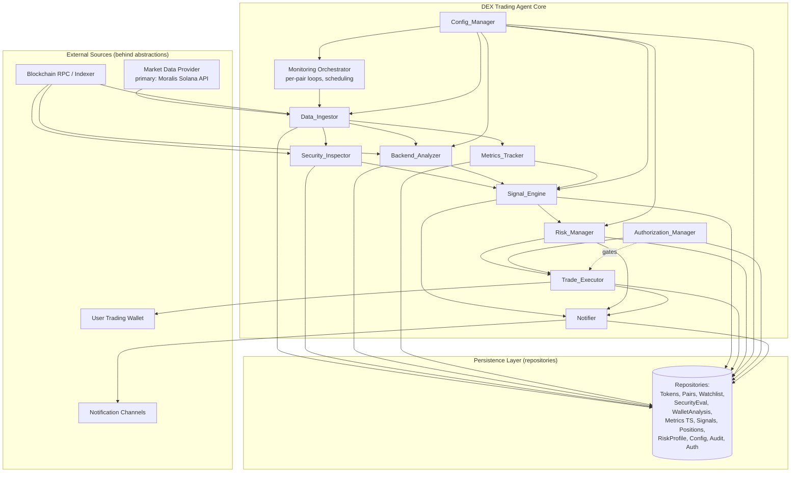
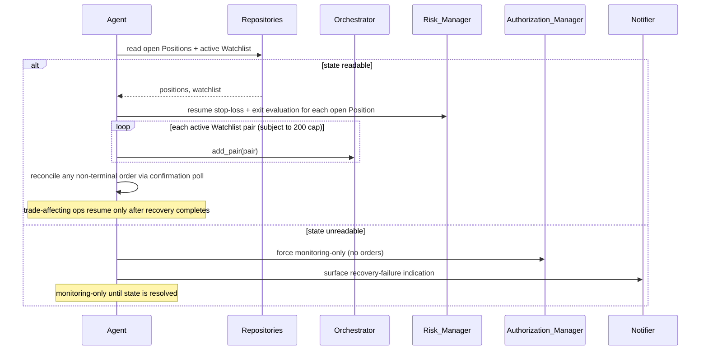

# Design Document: DEX Trading Agent

## Overview

The DEX Trading Agent is an autonomous monitoring-and-trading system for tokens on decentralized exchanges. It ingests live market and on-chain data, inspects token contracts for security risks, analyzes the wallets and transactions behind a token, continuously records market metrics as time series, computes entry/exit signals to protect against rug pulls and dumps, and—only when explicitly authorized—executes trades within user-defined risk limits.

### Design Principles and Safety Posture

Autonomous trading carries inherent and irreversible financial risk. The architecture treats **safety as the default** and trading as an explicitly-opted-into capability layered on top of a passive monitoring core:

1. **Monitoring-only by default.** The Agent boots into monitoring-only mode. No order can be submitted unless an authorized trading wallet is connected AND automated trading is explicitly enabled. (Requirements 11.3, 6.3)
2. **Explicit, revocable authorization.** Trade execution is gated behind a verified wallet authorization that the user can revoke at any time, after which monitoring continues but trading stops. (Requirement 11)
3. **Risk limits are mandatory and pre-trade.** Every buy passes through the Risk_Manager, which can only ever approve orders that keep both per-token and total exposure within configured limits. Rejection is the default outcome of any ambiguity. (Requirement 7)
4. **Defense against capital wipeout.** Stop-loss monitoring and rug-pull/dump exit signals are first-class, time-bounded behaviors. (Requirements 5, 7.5)
5. **Provider independence.** External data sources (DEX aggregator APIs, blockchain RPC/indexers) and the execution venue sit behind abstractions so the system is not coupled to any single vendor or chain.
6. **Durable, auditable behavior.** Every analysis and action is persisted to an append-only audit trail with retention controls. (Requirement 10)

### Technology Approach

The design is expressed in language-neutral pseudocode and interface contracts; the implementation language is selected during the task phase. The design assumes:

- An **async, event-driven runtime** capable of running 200+ concurrent monitoring loops cooperatively (e.g., an async task scheduler / worker pool).
- A **time-series-capable persistence layer** behind a repository abstraction (a relational store with time-indexed tables, or a dedicated TSDB; the abstraction hides the choice).
- **Pluggable external integrations** for market data, on-chain data, contract inspection, and trade execution.

---

## Architecture

### Component Diagram



### Layered View

| Layer | Responsibility | Components |
|-------|----------------|------------|
| **Ingestion** | Pull live market + on-chain data behind provider abstractions | Data_Ingestor, provider adapters |
| **Analysis** | Derive security, wallet, and market intelligence | Security_Inspector, Backend_Analyzer, Metrics_Tracker |
| **Decision** | Compute signals and approve/deny trades | Signal_Engine, Risk_Manager |
| **Action** | Execute trades, notify users | Trade_Executor, Notifier |
| **Control** | Schedule loops, manage config + authorization | Monitoring Orchestrator, Config_Manager, Authorization_Manager |
| **Persistence** | Durable storage + audit + retention | Repositories, Audit service |

### Data Ingestion Strategy

Live data acquisition is deferred behind a `MarketDataProvider` and a `ChainDataProvider` abstraction so the choice of vendor is a configuration/wiring decision, not an architectural one.

- **MarketDataProvider** (primary: the Moralis Solana Data API; a DEX aggregator REST API such as DexScreener serves as an optional fallback): resolves a Token contract to its Trading_Pair(s), and returns price, liquidity, market cap, FDV, buy/sell counts and volumes, pair creation time, and audit metadata.
- **ChainDataProvider** (primary: the Moralis Solana Data API for holders, swaps, and wallet/portfolio data; **Moralis Solana Streams** webhooks provide the primary real-time push path; the Solana RPC node serves as the base on-chain fallback and the authoritative source for SPL mint/freeze authority): returns contract/mint state, token holder distribution, and the transfer/swap transaction stream used for wallet behavior analysis.
- **ContractInspectorProvider** (primary on-chain authority detection via Solana RPC `getAccountInfo` on the SPL mint; Moralis token metadata + Token Score supply risk inputs; an optional security API such as GoPlus serves as a corroborating fallback): retrieves security posture / risk signals and inspects mint/freeze authority and Token-2022 extensions.
- **TradeVenueProvider**: submits swaps to a DEX router and reports on-chain confirmation.

```
interface MarketDataProvider:
    resolve_pairs(token_address, network) -> List[PairSnapshot] | NotFound
    fetch_pair_snapshot(pair_id) -> PairSnapshot | ProviderError
    discover_recent_pairs(filters, since) -> List[PairSnapshot]

interface ChainDataProvider:
    fetch_contract(token_address, network) -> ContractArtifact | Unverified | ProviderError
    fetch_contract_state_hash(token_address) -> StateHash | ProviderError
    fetch_holder_distribution(token_address) -> List[HolderBalance] | ProviderError
    fetch_transactions(pair_id, window) -> List[ChainTx] | ProviderError

interface TradeVenueProvider:
    submit_order(order_request) -> SubmittedOrder | SubmissionError
    poll_confirmation(tx_id, timeout) -> Confirmation | TimedOut

interface NotificationChannel:
    deliver(alert) -> DeliveryResult
```

The Data_Ingestor depends only on these interfaces; concrete adapters are injected at startup. For the initial Solana target (see **External Integrations** below), the wired adapters are:

- **MoralisAdapter** → `MarketDataProvider` (PRIMARY), `ChainDataProvider` (PRIMARY: holders, swaps, wallet/portfolio), `ContractInspectorProvider` (token metadata + Token Score as supply/spam risk inputs), and **Moralis Solana Streams** (PRIMARY real-time push via webhooks). The adapter is modeled as a single `MoralisAdapter` that implements these abstractions; it MAY be split into **MoralisMarketAdapter** / **MoralisChainAdapter** / **MoralisSecurityAdapter** / **MoralisStreamsAdapter** at implementation time without architectural change. For this design we keep the unified `MoralisAdapter` name and call out the roles explicitly. The adapter targets **two base URLs** — `https://solana-gateway.moralis.io` for Solana-native endpoints (metadata, batch metadata, pairs, swaps, holders, top-holders, new tokens, price) and `https://deep-index.moralis.io/api/v2.2` for Token Analytics and Token Score with `chain=solana` — authenticating with the `X-API-Key` header. Streams are managed at `https://api.moralis-streams.com` (`PUT /streams/solana`).
- **SolanaRpcAdapter** → `ChainDataProvider` base fallback **and the authoritative source for SPL mint/freeze authority detection** (base on-chain reads via Solana RPC: `getAccountInfo` on the SPL mint resolves `mintAuthority` / `freezeAuthority` / Token-2022 extensions, plus supply and largest-account reads and order-confirmation polling).
- **DexScreenerAdapter** → `MarketDataProvider` (OPTIONAL FALLBACK; used when Moralis market data is unavailable or for cross-checking).
- **GoPlusAdapter** → `ContractInspectorProvider` (OPTIONAL FALLBACK; corroborating security signals).
- **JupiterAdapter** → `TradeVenueProvider` (unchanged).
- **TelegramChannel** → `NotificationChannel` (unchanged).

**Provider-selection / fallback strategy.** Each abstraction resolves to its PRIMARY adapter first (Moralis for market/chain reads and supply risk inputs; Solana RPC for mint/freeze authority; Moralis Streams for real-time push). On a typed `ProviderError`, a timeout, or a missing required field from the primary, the Data_Ingestor falls back to the configured fallback adapter behind the same interface (DexScreener for `MarketDataProvider`, GoPlus for `ContractInspectorProvider`, Solana RPC for base `ChainDataProvider` reads) where that fallback is configured; otherwise the existing failure/last-good policy applies. Fallbacks are optional and disabled by default unless wired in configuration.

> **Component diagram note:** In the Architecture component diagram above, the abstract external boxes resolve to these concrete adapters for the Solana deployment — Market Data Provider = MoralisAdapter (primary), with DexScreenerAdapter as an optional fallback; Blockchain RPC / Indexer = MoralisAdapter (primary on-chain: holders/swaps/wallet) with SolanaRpcAdapter as the base fallback **and the authoritative source for SPL mint/freeze authority**, and **Moralis Solana Streams** as the primary real-time push path; the contract-inspection backing = SPL mint authority via Solana RPC (primary for authority) plus Moralis token metadata/Token Score (supply/spam risk inputs) with GoPlusAdapter as an optional fallback; the execution venue = JupiterAdapter; Notification Channels = TelegramChannel. The abstractions are retained so additional chains/vendors can be wired without architectural change.

---

## External Integrations

This section binds the concrete external APIs chosen for the initial deployment to the provider abstractions defined in the **Data Ingestion Strategy**. The abstractions are unchanged; these are wiring decisions.

### Scope

- **Initial target chain: Solana.** The provider abstractions (`MarketDataProvider`, `ChainDataProvider`, `ContractInspectorProvider`, `TradeVenueProvider`, `NotificationChannel`) are retained so that additional chains can be added later without architectural change — only new adapters are wired.
- **Quote assets: SOL and USDC.** `TradingPair.quote_asset` is constrained to these for the initial deployment.
- **Primary data source: Moralis Solana Data API.** Moralis is the PRIMARY backing for `MarketDataProvider`, `ChainDataProvider` (holders/swaps/wallet), security **risk inputs** (token metadata + Token Score), AND **real-time** (Moralis Solana Streams webhooks). **Solana RPC** is the base on-chain fallback, the **authoritative source for SPL mint/freeze authority detection**, and the order-confirmation polling path; Jupiter remains the execution venue; Telegram remains the notification channel. **DexScreener** and **GoPlus** are demoted to OPTIONAL fallback adapters behind the same interfaces (used when Moralis data is unavailable or for cross-checking).

### Integration Map

| Concrete API | Base URL | Abstraction (adapter) | Role | Auth / Secrets | Supports |
|--------------|----------|-----------------------|------|----------------|----------|
| **Moralis (Solana Data API)** | `https://solana-gateway.moralis.io` (Solana-native) + `https://deep-index.moralis.io/api/v2.2` (analytics/score, `chain=solana`) | `MarketDataProvider` + `ChainDataProvider` + `ContractInspectorProvider` (MoralisAdapter) | **PRIMARY** read-only market metrics, on-chain holders/swaps/wallet, and security risk inputs (token metadata + Token Score) | `X-API-Key` header | Req 1.1, 1.5/1.6, 4.1–4.3, 3.1–3.3, 3.6/3.7, 2.4/2.5 (+2.9 mapping) |
| **Moralis Solana Streams** | `https://api.moralis-streams.com` (`PUT /streams/solana`) | `ChainDataProvider` real-time push (MoralisAdapter / Streams) | **PRIMARY real-time** webhooks; `mintAddresses`/`addresses`/`programIds` filters; payload carries pre/postTokenBalances keyed on `signature`; automatic retries until HTTP 200 | `x-api-key` header (Streams) | low-latency Req 5.3/5.4/5.5 |
| **Solana RPC** | https://solana.com/docs/rpc | `ChainDataProvider` base fallback + authority detection (SolanaRpcAdapter) | Base on-chain account/supply/holder/tx reads, **authoritative SPL mint/freeze authority detection**, and confirmation polling | RPC endpoint URL (optional key per provider) | Req 2.4/2.5 (authority), Req 2 (state/supply), Req 3 (holders/tx), 6.5/6.6 |
| **Jupiter** | https://dev.jup.ag/ | `TradeVenueProvider` + price/quote (JupiterAdapter) | Quote/Swap + price for sizing (unchanged) | None for quotes; signer for swaps | Req 6.1/6.2/6.4; confirmation via Solana RPC (6.5/6.6) |
| **Telegram Bot API** | https://core.telegram.org/bots/api | `NotificationChannel` (TelegramChannel) | Alert/confirmation delivery (unchanged) | Bot token + chat id | Req 8.x |
| **DexScreener** _(optional fallback)_ | https://docs.dexscreener.com/api/reference | `MarketDataProvider` (DexScreenerAdapter) | OPTIONAL FALLBACK read-only market metrics / cross-check | None (public) | Req 4.x; pair resolution for 1.1 (fallback) |
| **GoPlus Security** _(optional fallback)_ | https://docs.gopluslabs.io/reference/api-overview | `ContractInspectorProvider` / Security_Inspector (GoPlusAdapter) | OPTIONAL FALLBACK Solana token security signals / corroboration | API key (recommended) | Req 2.4/2.5 (+ 2.9 mapping) fallback |

### Per-Integration Details

**Moralis (Solana Data API) → MarketDataProvider + ChainDataProvider + ContractInspectorProvider + Streams (MoralisAdapter) — PRIMARY.** The adapter targets **two base URLs** — `https://solana-gateway.moralis.io` for Solana-native endpoints and `https://deep-index.moralis.io/api/v2.2` for Token Analytics and Token Score (with `chain=solana`) — and Streams are managed at `https://api.moralis-streams.com`. Authenticated with a Moralis API key injected from secrets/config (read-only data scope) via the `X-API-Key` header (Streams use the `x-api-key` header). See the **Moralis Endpoint Reference (Solana)** subsection below for the concrete method→endpoint mapping and key response fields. The adapter is the primary backing for market data, chain reads, security risk inputs, and real-time, and uses the following documented endpoint groups:

- **Metadata.** `GET /token/{net}/{addr}/metadata` and batch `POST /token/{net}/metadata` (up to 100 addresses) → Token/Trading_Pair resolution and metadata (Req 1.1), supply/decimals/marketCap/fullyDilutedValue for Market_Cap / FDV math (Req 4.1), plus `isVerifiedContract`, `possibleSpam`, `score`, and `metaplex.updateAuthority`/`isMutable` as security risk inputs (Req 2.4/2.9). The batch endpoint coalesces per-pair lookups (see Rate Limits & Real-Time Strategy).
- **Market metrics / prices / pairs** → `GET /tokens/{addr}/analytics` (deep-index) for buy/sell volume and counts and liquidity/FDV trends (Req 4.1–4.3); `GET /token/{net}/{addr}/price` for sizing; `GET /token/{net}/{addr}/pairs` for pair resolution (Req 1.1).
- **Holders** → `GET /token/{net}/holders/{addr}` and `GET /token/{net}/{addr}/top-holders` for holder distribution and top-10 concentration inputs (Req 3.6/3.7).
- **Swaps + Wallet API** → `GET /token/{net}/{addr}/swaps` (per-swap `walletAddress`, `transactionType` buy/sell, `bought`/`sold`, `blockTimestamp`) plus wallet balance/portfolio/token-balance endpoints, feeding bot-wallet behavioral analysis (Req 3.1–3.3). Bot/sniper detection uses these per-swap fields together with Streams pre/postTokenBalance deltas and the existing custom heuristics — there is **no dedicated sniper API** (the Moralis Snipers endpoint is deprecated/removed; see below).
- **Discovery** → `GET /token/{net}/exchange/{exchange}/new` (Pump.fun new tokens — returns tokens <24h old with `createdAt`) and token-search → discovery of recent pairs (Req 1.5/1.6).
- **Token Score (risk input)** → `GET /tokens/{addr}/score` (deep-index, `chain=solana`): numeric `score` plus market metrics, used as an **additional risk input** for `Security_Inspector` — **not** as the authority source (see Solana Security Semantics).
- **Real-time (Streams)** → `PUT /streams/solana` with a `mintAddresses` filter; the webhook payload includes `preTokenBalances`/`postTokenBalances` per transaction keyed on `signature`.

> **Deprecated endpoints (removed June 4, 2026).** The Moralis **Snipers** endpoint (`GET /token/{network}/pairs/{pairAddress}/snipers`) and the **Filtered Tokens** discovery endpoint (`POST /discovery/tokens`) have been **removed** and MUST NOT be used. Sniper/bot detection is derived from Token Swaps + Streams balance deltas with custom heuristics; discovery uses Pump.fun new tokens + token-search.

Moralis market/chain endpoints are **REST/polling**, so they are fronted by the per-provider rate limiter and batched via the batch-metadata endpoint and budgeted by compute units (CU); **latency-sensitive events are handled by Moralis Solana Streams** (see Rate Limits & Real-Time Strategy). The `MoralisAdapter` MAY be split into `MoralisMarketAdapter` / `MoralisChainAdapter` / `MoralisSecurityAdapter` / `MoralisStreamsAdapter`; the unified name is retained in this design.

**DexScreener → MarketDataProvider (DexScreenerAdapter) — OPTIONAL FALLBACK.** Read-only REST source for price, liquidity, market cap, FDV, and buys/sells counts and buy/sell volume bucketed over the m5 / h1 / h6 / h24 windows. Used as an **optional fallback** behind `MarketDataProvider` when Moralis market data is unavailable (typed `ProviderError`/missing field) or for cross-checking; it can resolve a Token contract to its Trading_Pair(s) (Req 1.1) and feed `Metrics_Tracker` (Req 4.x) in that fallback role. There is **no public websocket**, so data is acquired by polling. Rate limits are approximately **300 req/min** for token/pair endpoints and **60 req/min** for profiles/boosts endpoints (see Rate Limits & Real-Time Strategy under Concurrency). Disabled unless wired in configuration.

**Solana RPC → ChainDataProvider base fallback + authority detection (SolanaRpcAdapter).** Provides the **base on-chain fallback** reads used by `Security_Inspector` and `Backend_Analyzer` when Moralis chain data is unavailable, the **authoritative source for SPL mint/freeze authority**, plus order-confirmation polling:
- `getAccountInfo` — SPL **mint** account state: an active (non-null) `mintAuthority`, an active (non-null) `freezeAuthority`, and any Token-2022 transfer-fee extension are the **authoritative** inputs for `MINTABLE` / `TRANSFER_DISABLE` / `FEE_MODIFIABLE` (Req 2.4/2.5); also used for `fetch_contract_state_hash` change detection (Req 2.10).
- `getTokenSupply` — total supply for concentration math (Req 3.6).
- `getTokenLargestAccounts` — top holders for `fetch_holder_distribution` (Req 3.6, 3.7).
- `getSignaturesForAddress` + `getTransaction` — transaction stream for wallet analysis (Req 3) and order-confirmation polling (Req 6.5/6.6).

**Real-time (Moralis Solana Streams).** Liquidity-removal (rug) and dump detection and other time-critical conditions (Req 5.3/5.4 and the ≤5s exit alert of Req 5.5) are driven by **Moralis Solana Streams webhooks** as the PRIMARY low-latency mechanism rather than tight polling. A stream is created with `PUT /streams/solana` filtered by the watched `mintAddresses` (and/or `programIds`); each webhook delivers matched transactions carrying `preTokenBalances`/`postTokenBalances` keyed on the transaction `signature`, with Moralis retrying delivery until the endpoint returns HTTP 200. The agent therefore **exposes a publicly reachable HTTPS webhook endpoint**, implements the **empty-body verification handshake** (respond HTTP 200 to the test POST), and uses an **idempotent webhook intake keyed on `signature`** with dedupe that **always returns HTTP 200** even when its own downstream processing errors (so retries are not triggered spuriously). Balance deltas computed from pre/postTokenBalances feed both the Signal_Engine exit path (Req 5.3/5.4) and the Backend_Analyzer bot/sniper heuristics.

**GoPlus Security → ContractInspectorProvider / Security_Inspector (GoPlusAdapter) — OPTIONAL FALLBACK.** Supplies Solana token security signals — mint authority, freeze authority, transfer-fee (Token-2022) extensions, ownership/authority privileges, and malicious flags — mapped to `SecurityIssue` types (Req 2.4) and the Critical trigger (Req 2.5). In this deployment GoPlus is an **optional corroborating fallback**: `Security_Inspector` derives mint/freeze authority **authoritatively from the Solana RPC SPL mint** and supplements with Moralis token-metadata/Token-Score risk inputs, consulting GoPlus only for corroboration or when the primary sources are unavailable. See **Solana Security Semantics** under Security Considerations for the EVM→Solana mapping and the re-interpretation of Req 2.9. Disabled unless wired in configuration.

**Jupiter → TradeVenueProvider + price/quote (JupiterAdapter).** The Quote API and Swap API return a **serialized transaction to sign**; the adapter attaches the user-configured slippage tolerance via Jupiter's native **slippage** parameter (Req 6.4) and submits the signed transaction for execution (Req 6.1/6.2). The price API is used for position sizing. On-chain confirmation is polled via Solana RPC (Req 6.5/6.6). Signing follows the injected-signer model (see Signer / Key Handling under Security Considerations).

**Telegram Bot API → NotificationChannel (TelegramChannel).** Delivers alerts and trade confirmations through the bot `sendMessage` method (Req 8.x). Requires a bot token and target chat id, injected via secrets/config. Per-channel retry, quiet-hours, and final-status recording follow the `Notifier` policy unchanged.

### Moralis Endpoint Reference (Solana)

This subsection maps each provider-abstraction method to the concrete Moralis (or Solana RPC) endpoint chosen for the initial deployment and the key response fields consumed. Solana-native endpoints are served from `https://solana-gateway.moralis.io` (path uses `{net}` = `mainnet`); Token Analytics and Token Score are served from `https://deep-index.moralis.io/api/v2.2` with `chain=solana`. Auth header is `X-API-Key` (Streams use `x-api-key` at `https://api.moralis-streams.com`). The per-endpoint compute-unit (CU) cost is listed so the rate limiter can budget by CU.

| Interface method / use | Endpoint | Host | Key response fields | CU |
|------------------------|----------|------|---------------------|----|
| `resolve_pairs` (Req 1.1) | `GET /token/{net}/{addr}/pairs` | solana-gateway | `pairAddress`, `liquidityUsd`, `baseToken`/`quoteToken`, `volume24hrUsd`, `usdPrice` | 50 |
| `fetch metadata` (Req 1.1, 4.1, 2.4/2.9) | `GET /token/{net}/{addr}/metadata`; batch `POST /token/{net}/metadata` (≤100) | solana-gateway | `mint`, `decimals`, `totalSupply`, `marketCap`, `fullyDilutedValue`, `isVerifiedContract`, `possibleSpam`, `score`, `metaplex.updateAuthority`/`metaplex.isMutable` | 10 (single) / 100 (batch) |
| market metrics (Req 4.1–4.3) | `GET /tokens/{addr}/analytics` (`chain=solana`) | deep-index | `totalBuyVolume`/`totalSellVolume`/`totalBuys`/`totalSells`/`uniqueWallets` bucketed 5m/1h/6h/24h, `totalLiquidity`, `totalFullyDilutedValuation` | 80 |
| price / sizing (Req 4.1, 6.x sizing) | `GET /token/{net}/{addr}/price`; batch `POST /token/{net}/prices` | solana-gateway | `usdPrice`, `nativePrice`, `usdPrice24hrPercentChange` | 50 |
| holder concentration (Req 3.6/3.7) | `GET /token/{net}/holders/{addr}`; `GET /token/{net}/{addr}/top-holders` | solana-gateway | `holderSupply.top10.supplyPercent`, `totalHolders`; per-holder `percentageRelativeToTotalSupply`, `totalSupply` | 50 |
| swaps / wallet behavior (Req 3.1–3.3) | `GET /token/{net}/{addr}/swaps` | solana-gateway | `walletAddress`, `transactionType` (buy/sell), `bought`/`sold`, `blockTimestamp` | 50 |
| discovery (Req 1.5/1.6) | `GET /token/{net}/exchange/{exchange}/new` (Pump.fun) + token-search | solana-gateway | `createdAt` (<24h), token address/metadata | 50 |
| token score (risk input only; Req 2.4/2.9) | `GET /tokens/{addr}/score` (`chain=solana`) | deep-index | numeric `score`, `metrics` (liquidity/volume/txn/supply incl. `supply.top10Percent`) | 100 |
| mint/freeze authority (authoritative; Req 2.4/2.5) | Solana RPC `getAccountInfo`; `getTokenSupply`; `getTokenLargestAccounts` | Solana RPC | `mintAuthority`, `freezeAuthority`, Token-2022 transfer-fee extension; supply; largest accounts | — (RPC) |
| real-time (Req 5.3/5.4/5.5) | Streams `PUT /streams/solana` (filter `mintAddresses`) | api.moralis-streams | webhook payload: per-tx `preTokenBalances`/`postTokenBalances` keyed on `signature`; retries until HTTP 200 | — (push) |

> The **Snipers** (`/token/{network}/pairs/{pairAddress}/snipers`) and **Filtered Tokens** (`POST /discovery/tokens`) endpoints are **removed** and intentionally absent from this table; their roles are fulfilled by the Token Swaps + Streams-delta heuristics and by Pump.fun new-tokens + token-search respectively.

---

## Components and Interfaces

### Monitoring Orchestrator

Owns the lifecycle of per-pair monitoring loops. Maintains a bounded registry of active pairs (cap = 200), schedules refresh ticks at the configured interval, and runs the auto-discovery scan loop. Enforces the concurrency cap before admitting a pair.

```
class MonitoringOrchestrator:
    active_pairs: Map[PairId, MonitorHandle]   # invariant: size <= 200

    add_pair(pair) -> Result:
        if size(active_pairs) >= 200: return Error(CONCURRENCY_LIMIT)   # Req 1.11
        start_loop(pair); return Ok
    remove_pair(pair_id): stop_loop(pair_id)    # data retained in repos (Req 1.4)
    tick(pair_id): ingest -> analyze -> track -> signal      # per Data_Refresh_Interval

    recover_on_startup() -> Result:             # runs before any trade-affecting op  # Req 13.1
        try:
            positions = repo.open_positions()      # status == OPEN
            watchlist = repo.active_watchlist()    # active == true
        on read failure:
            authz.force_monitoring_only()          # no orders until resolved          # Req 13.4
            Notifier.alert(RECOVERY_FAILURE); start monitoring-only; return Error
        for pos in positions:
            resume stop_loss + exit-signal evaluation for pos                          # Req 13.2
        for entry in watchlist:                    # subject to 200 cap                # Req 13.3
            add_pair(entry.pair)                   # add_pair enforces CONCURRENCY_LIMIT
        reconcile any non-terminal order via on-chain confirmation poll                # Req 12 / 13
        return Ok
```

**Maps to:** Requirements 1.1, 1.3, 1.7, 1.10, 1.11, 13.1, 13.2, 13.3, 13.4.

### Data_Ingestor

Resolves tokens to pairs, refreshes pair data on the configured interval, runs discovery scans, and implements the retry/stale-data policy.

```
class DataIngestor:
    add_token_to_watchlist(token_addr, network) -> Result:
        pairs = market.resolve_pairs(token_addr, network)
        if pairs empty: return Error(PAIR_NOT_FOUND, token_addr)        # Req 1.2
        register first/selected pair; trigger security eval; return Ok  # Req 1.1
    refresh(pair) -> Snapshot:
        try snapshot = market.fetch_pair_snapshot(pair.id)
        on success: reset failure_count; persist; return snapshot
        on failure: failure_count += 1; keep last_good; if count==5 -> Notifier.stale(pair)  # Req 1.8, 1.9
    discovery_scan(filters):   # interval 30..300s, only pairs < 24h old   # Req 1.5, 1.6
        for p in market.discover_recent_pairs(filters, now-24h):
            if matches(filters, p): orchestrator.add_pair(p)
```

**Maps to:** Requirements 1.1, 1.2, 1.5–1.9.

### Security_Inspector

Evaluates contract privileges and assigns the Severity_Rating as the maximum of contributing issue severities. Handles unverified contracts and re-evaluates on contract state change.

```
SEVERITY_ORDER = [None, Low, Medium, High, Critical]   # index = ordinal

class SecurityInspector:
    evaluate(token) -> SecurityEvaluation:
        artifact = chain.fetch_contract(token.address, token.network) within 30s
        if timed_out or unverified:
            return Eval(rating=High, unverified=true, ts=utc_now_seconds())  # Req 2.9
        issues = detect_issues(artifact)   # mintable, transfer-disable, fee-mod, ownership  # Req 2.4
        if any issue allows arbitrary transfer disable: issue.severity = Critical  # Req 2.5
        rating = max_by_ordinal(issues.severity, default=None)                 # Req 2.7
        return Eval(rating, issues, ts=utc_now_seconds())                      # Req 2.6, 2.8
    on_state_change(token):   # re-evaluate within 60s                          # Req 2.10
        evaluate(token); update rating
```

**Maps to:** Requirements 2.1–2.10.

### Backend_Analyzer

Classifies transacting wallets, computes the bot-transaction percentage and holder concentration over a configurable window, and raises threshold alerts/flags.

```
class BackendAnalyzer:
    analyze(pair, window) -> WalletAnalysis:
        txs = chain.fetch_transactions(pair.id, window)
        if provider unavailable: record error result; keep prior; return  # Req 3.9
        wallets = distinct(txs.wallet)                                    # Req 3.1
        classify each wallet as Bot_Wallet xor non-bot (exactly one)      # Req 3.2
        if txs empty: bot_pct=0; distinct_count=0                         # Req 3.4
        else: bot_pct = 100 * count(tx from bot wallets) / count(txs)     # Req 3.3  (in [0,100])
        concentration = 100 * sum(top10 holder balances)/total_supply     # Req 3.6  (in [0,100])
        if bot_pct > bot_threshold: Notifier.alert(pair, bot_pct) <=60s    # Req 3.5
        if concentration > conc_threshold: flag concentration risk         # Req 3.7
        persist(analysis with pair_id + ts)                                # Req 3.8
```

**Maps to:** Requirements 3.1–3.9.

### Metrics_Tracker

Appends time-series entries on each refresh and serves range queries with validation.

```
class MetricsTracker:
    record(pair, snapshot):
        append liquidity, market_cap, fdv at refresh                      # Req 4.1
        append buy/sell counts and volumes per measurement period         # Req 4.2, 4.3
        each entry = {metric, value|MISSING, ts(second), pair_id}         # Req 4.4, 4.10
        record audit provider/result/date if available                    # Req 4.5
    query_history(pair, start, end) -> Result:
        if not monitored(pair): return Error(NOT_MONITORED)               # Req 4.8
        if start > end: return Error(INVALID_RANGE)                       # Req 4.7
        entries = repo.entries_in_range(pair, start, end) ordered asc     # Req 4.6, 4.9
        return entries   # possibly empty                                  # Req 4.9
```

**Maps to:** Requirements 4.1–4.10.

> **Audit field clarification (Req 4.5).** Formal third-party audit metadata is not reliably available from the chosen APIs. For the Solana deployment the recorded "audit" information (`AuditInfo`) is redefined as **best-effort security metadata sourced PRIMARILY from the Solana RPC SPL mint authority checks plus Moralis token metadata / Token Score risk inputs** (with GoPlus as an optional fallback when configured): `provider = "Moralis+SolanaRPC"` (or `"GoPlus"` when the fallback supplied the data), `result =` the security summary returned by the providing adapter, and `audit_date =` the fetch time. This field remains **optional** and is omitted (left null) when no security metadata is available, satisfying the `WHERE audit information is available` condition of Req 4.5.

### Signal_Engine

Computes entry/exit signals at each Signal_Computation_Interval, detecting rug-pull (liquidity drop) and dump (sell/buy volume ratio) conditions over a single Measurement_Period; marks eligibility honoring severity ceiling.

```
class SignalEngine:
    compute(pair) -> Signals:
        if metrics stale/unavailable: skip; record skipped; keep prior   # Req 5.7
        entry = score_entry(security, wallet, metrics)                    # Req 5.1
        eligible = entry >= entry_threshold AND severity <= max_severity  # Req 5.2
        exit = None
        if liquidity_drop_pct(prev,curr) > rugpull_threshold:
            exit = ExitSignal(RUG_PULL)                                   # Req 5.3
        elif sell_volume/buy_volume > dump_threshold:
            exit = ExitSignal(DUMP)                                       # Req 5.4
        record signals with contributing metrics + ts                     # Req 5.6
        if exit and position_held(pair): Notifier.alert(pair, exit) <=5s  # Req 5.5
        return Signals(entry, eligible, exit)
```

**Maps to:** Requirements 5.1–5.8.

### Risk_Manager

Pre-trade gatekeeper. Approves a buy only if both resulting per-token position and total exposure stay within limits and severity is acceptable. Drives stop-loss.

```
class RiskManager:
    profile: RiskProfile

    approve_buy(order) -> Decision within 2s:                             # Req 7.2
        if token.severity > profile.max_severity:
            return Reject(SEVERITY_EXCEEDED)                              # Req 7.7
        new_token_size = current_position(token) + order.notional
        new_total = current_total_exposure() + order.notional
        if new_total > profile.max_total_exposure:
            return Reject(TOTAL_EXPOSURE_EXCEEDED)                        # Req 7.3
        if new_token_size > profile.max_position_per_token:
            return Reject(PER_TOKEN_EXCEEDED)                             # Req 7.4
        return Approve                                                     # Req 7.2 (only if within both)
    monitor_stop_loss():  # evaluated every <=60s                          # Req 7.5
        for pos in open_positions:
            if unrealized_loss_pct(pos) >= profile.stop_loss_pct:
                request_sell_full(pos) within 5s
    update_profile(new):  # applies only to decisions after completion     # Req 7.6
```

**Maps to:** Requirements 7.1–7.7.

### Trade_Executor

Submits orders only when authorized + automated trading enabled; enforces the in-flight / idempotency guard (at most one in-flight order per pair); determines order size from the Per_Order_Size capped to risk limits and checks balance sufficiency; applies slippage; records confirmations; handles timeout/failure/slippage cancellation without side effects; clears the in-flight marker on terminal states.

```
class TradeExecutor:
    in_flight: InFlightRegistry

    submit_entry(pair, order) -> Result:
        if not authz.trading_enabled(): return NoOp(MONITORING_ONLY)      # Req 11.3, 6.3
        if token has no severity rating: reject                           # Req 2.3
        # ---- in-flight / idempotency guard (entries) ----
        if position_open(pair) OR in_flight.has_in_flight(pair):
            return NoOp(SUPPRESSED_DUPLICATE_ENTRY)                       # Req 12.1, 12.2
        # ---- position sizing from Per_Order_Size, capped to risk limits ----
        size = resolve_order_size(profile.per_order_size, pair)           # Req 6.9
        size = cap_to_risk_limits(size, pair, profile)                    # Req 6.9 (per-token + total)
        # ---- balance sufficiency ----
        if available_quote_balance() < order_cost(size, pair):
            record(INSUFFICIENT_BALANCE, pair); Notifier.alert(pair, INSUFFICIENT_BALANCE)
            return NoOp(INSUFFICIENT_BALANCE)                             # Req 6.10
        return _dispatch(pair, BUY, with_size(order, size))

    submit_exit(pair, order) -> Result:
        if not authz.trading_enabled(): return NoOp(MONITORING_ONLY)      # Req 11.3, 6.3
        # ---- in-flight / idempotency guard (no duplicate sell in flight) ----
        if in_flight.has_in_flight(pair) and in_flight.by_pair[pair].kind == SELL:
            return NoOp(SUPPRESSED_DUPLICATE_SELL)                        # Req 12.3
        return _dispatch(pair, SELL, order)

    resolve_order_size(per_order_size, pair) -> decimal:                  # Req 6.9, 7.2
        if per_order_size.kind == FIXED_QUOTE:
            return per_order_size.value                                   # fixed Quote_Asset amount
        else: # PERCENT_BALANCE
            return available_quote_balance() * per_order_size.value / 100

    _dispatch(pair, kind, order) -> Result:
        apply max_slippage to order                                       # Req 6.4
        submitted = venue.submit_order(order)
        if submission fails: record reason; notify <=5s; no state change   # Req 6.7
                            (no in-flight marker set on failed submission)
        in_flight.mark(pair, submitted)        # exactly one in-flight order per pair  # Req 12.1
        conf = venue.poll_confirmation(submitted.tx, timeout)             # Req 6.6 (10..600s, def 60)
        if timed out: cancel; record timeout; no state change; in_flight.clear(pair)   # Req 6.6, 12.4
        if executed_slippage > max_slippage: cancel; record; no change; in_flight.clear(pair) # Req 6.8, 12.4
        on confirmation: record type/price/qty/fee/tx_id + ts <=5s         # Req 6.5
                        in_flight.clear(pair)  # terminal state reached     # Req 12.4
        update position; Notifier.confirm <=10s                            # Req 8.1
```

The in-flight marker is set exactly when an order is accepted for submission and cleared exactly when that order reaches a terminal state (`CONFIRMED`, `CANCELLED`, `FAILED`, `TIMED_OUT`), so at most one order per pair is ever in flight (Req 12.1–12.4). Position sizing derives the buy size from the `Per_Order_Size` (fixed Quote_Asset amount or percent of available balance) and caps it so the resulting per-Token position and total exposure stay within the Risk_Profile limits before the Risk_Manager's independent approval (Req 6.9); an order that cannot be funded by the available Quote_Asset balance is never submitted (Req 6.10).

**Maps to:** Requirements 6.1–6.10 (with 2.3, 8.1, 11.3, 12.1–12.4).

### Notifier

Delivers alerts on all enabled channels with retry, quiet-hours suppression (except Critical alerts and Exit_Signal alerts for held positions, which are always delivered), and undelivered recording.

```
class Notifier:
    send(alert):
        channels = enabled_channels()
        for ch in channels:                                               # Req 8.3
            # always-deliver set: Critical OR Exit_Signal alert for a pair with a held Position
            always_deliver = (alert.severity == Critical)
                             OR (alert.is_exit_signal AND position_held(alert.pair))
            if quiet_hours_now() and not always_deliver: suppress         # Req 8.6
            attempts = 0
            while attempts < 4:                                           # 1 + up to 3 retries  # Req 8.4
                if ch.deliver(alert).ok: mark delivered; break
                attempts++; wait >= 5s
            if attempts == 4: mark undelivered(ch); surface failure        # Req 8.5
```

During a configured quiet-hours window the Notifier suppresses only alerts that are **neither** Critical **nor** an Exit_Signal alert for a Trading_Pair in which a Position is held; Critical alerts and Exit_Signal alerts for held positions are always delivered within 10s regardless of quiet hours (Req 8.6).

**Maps to:** Requirements 8.1–8.6 (+ exit-signal retry policy 5.8).

### Authorization_Manager

Verifies wallet authorization, gates trading, processes revocation, and records every status change.

```
class AuthorizationManager:
    connect_wallet(wallet) -> Result within 5s:                           # Req 11.1
        if verify(wallet) ok within 5s: enable_trading(); record(ENABLED, ts)
        else: stay monitoring-only; surface error; record(FAILED, ts)     # Req 11.2
    revoke():                                                              # Req 11.4, 11.5
        disable_trading() within 5s; keep monitoring; record(REVOKED, ts)
    trading_enabled() -> bool   # false unless an authorized wallet connected  # Req 11.3
```

**Maps to:** Requirements 11.1–11.6.

### Config_Manager

Validates parameter ranges/types, persists valid configs, loads latest at startup, applies documented defaults, and tolerates persistence failure.

```
PARAM_RANGES = {
  refresh_interval_s: [5,300], signal_interval_s: [1,300],
  discovery_scan_interval_s: [30,300], measurement_period_s: [60,86400],
  bot_pct_threshold: [0,100], holder_conc_threshold: [0,100],
  rugpull_threshold: [0,100], dump_threshold: [0.1,100],
  entry_threshold: [0,100], slippage_tolerance: [0.01,100],
  stop_loss_pct: [0.01,100], confirmation_timeout_s: [10,600],
  exit_alert_retries: [1,10], retention_days: [30,3650] }

class ConfigManager:
    save(input) -> Result:
        for p,v in input:
            if v missing/non-numeric: return Error(p)                     # Req 9.3
            if v outside PARAM_RANGES[p]: return Error(p, range); keep active  # Req 9.2
        persist(input); apply within 5s                                    # Req 9.4
    load_at_startup():
        cfg = repo.latest_config() or DEFAULTS                             # Req 9.5, 9.6
    on persist failure: keep active; continue; surface indication          # Req 9.7
```

**Maps to:** Requirements 9.1–9.7.

### Audit / Persistence Service

Append-only record of analyses and actions with retry and retention enforcement.

```
class AuditService:
    record(action_type, pair_id, outcome):
        ts = utc_now_millis()                                             # Req 10.1
        retries = 0
        while not persist(record) and retries < 3: retries++             # Req 10.7
        if still failed: persist(failure_record(action_type)); continue   # Req 10.7
    query(pair, start, end) -> Result:
        if start > end: return Error(INVALID_RANGE)                       # Req 10.4
        return repo.records_in_range(pair, start, end) asc                # Req 10.2, 10.3
    enforce_retention():   # period 30..3650 days, default 30
        delete records where age > retention_period                       # Req 10.5, 10.6
```

**Maps to:** Requirements 10.1–10.7.

---

## Data Models

```
# ---- Identity & Market ----
Network: enum { ... }                      # chain identifier
Token:
    address: string                        # contract address (unique per network)
    network: Network
    symbol: string
    name: string
    total_supply: decimal

TradingPair:
    id: string                             # unique pair identifier
    token: Token
    quote_asset: string
    dex: string
    created_at: timestamp                  # first-listed time (for <24h discovery)

WatchlistEntry:
    pair_id: string
    added_at: timestamp
    source: enum { MANUAL, AUTO_DISCOVERY }
    active: bool                           # false after removal; data retained

PairSnapshot:                              # one ingestion sample
    pair_id: string
    price: decimal
    liquidity: decimal
    market_cap: decimal
    fdv: decimal
    buy_count: int
    sell_count: int
    buy_volume: decimal
    sell_volume: decimal
    audit: AuditInfo?                       # optional
    fetched_at: timestamp(seconds)
    is_stale: bool                          # true when serving last-good after failure

# ---- Security ----
Severity: enum ordered { None=0, Low=1, Medium=2, High=3, Critical=4 }

SecurityIssue:
    type: enum { MINTABLE, TRANSFER_DISABLE, FEE_MODIFIABLE, OWNERSHIP_PRIVILEGE, UNVERIFIED }
    description: string
    severity: Severity                      # contributing severity

SecurityEvaluation:
    token_address: string
    rating: Severity                        # = max(issues.severity), default None
    issues: List[SecurityIssue]
    unverified: bool
    evaluated_at: timestamp(seconds, UTC)

# ---- Wallet / Backend ----
WalletClassification: enum { BOT, NON_BOT }

WalletAnalysis:
    pair_id: string
    window_minutes: int                     # 1..1440
    distinct_wallet_count: int              # >= 0
    bot_tx_percentage: decimal              # 0..100
    holder_concentration_pct: decimal       # 0..100 (top-10)
    concentration_risk_flag: bool
    data_unavailable: bool
    analyzed_at: timestamp

HolderBalance:
    wallet: string
    balance: decimal

# ---- Metrics (time series) ----
MetricKind: enum { LIQUIDITY, MARKET_CAP, FDV, BUY_COUNT, SELL_COUNT, BUY_VOLUME, SELL_VOLUME }
MetricEntry:
    pair_id: string
    kind: MetricKind
    value: decimal | MISSING
    recorded_at: timestamp(seconds)         # series ordered ascending by this
AuditInfo:
    provider: string
    result: string
    audit_date: date

# ---- Signals ----
SignalType: enum { ENTRY, EXIT }
ExitClass: enum { RUG_PULL, DUMP, STOP_LOSS, MANUAL }
Signal:
    pair_id: string
    type: SignalType
    score: decimal                          # entry score
    eligible: bool                          # entry only
    exit_class: ExitClass?                  # exit only
    contributing_metrics: Map
    generated_at: timestamp

# ---- Positions & Risk ----
Position:
    pair_id: string
    token_address: string
    quantity: decimal
    avg_entry_price: decimal
    notional_cost: decimal                  # exposure contribution
    opened_at: timestamp
    status: enum { OPEN, CLOSED }

PerOrderSizeKind: enum { FIXED_QUOTE, PERCENT_BALANCE }   # discriminator
PerOrderSize:
    kind: PerOrderSizeKind
    value: decimal                          # FIXED_QUOTE: Quote_Asset amount (>= 0);
                                            # PERCENT_BALANCE: percent of available
                                            #   Quote_Asset balance in (0, 100]

RiskProfile:
    per_order_size: PerOrderSize            # Req 7.1, 7.2 — fixed Quote_Asset amount
                                            #   OR percent-of-available-balance (discriminated)
    max_position_per_token: decimal         # >= 0
    max_total_exposure: decimal             # >= 0
    max_acceptable_severity: Severity
    stop_loss_pct: decimal                  # 0.01..100

# ---- Orders / Execution ----
OrderKind: enum { BUY, SELL }
OrderStatus: enum { SUBMITTED, CONFIRMED, CANCELLED, FAILED, TIMED_OUT }
OrderRecord:
    pair_id: string
    kind: OrderKind
    requested_qty: decimal
    notional: decimal
    max_slippage: decimal                   # 0.01..100
    executed_price: decimal?
    executed_qty: decimal?
    fee: decimal?
    tx_id: string?
    status: OrderStatus
    reason: string?                         # cancellation/failure reason
    recorded_at: timestamp

# ---- In-Flight Order Tracking (Trade Idempotency, Req 12) ----
# A terminal OrderStatus is one of { CONFIRMED, CANCELLED, FAILED, TIMED_OUT };
# SUBMITTED is the sole non-terminal (in-flight) state.
TERMINAL_ORDER_STATUS = { CONFIRMED, CANCELLED, FAILED, TIMED_OUT }

InFlightRegistry:                           # tracks at most one active order per pair
    by_pair: Map[PairId, OrderRecord]       # invariant: a pair is present iff it has a
                                            #   non-terminal (SUBMITTED) order in flight (Req 12.1)
    mark(pair_id, order)                    # set when an order is submitted
    clear(pair_id)                          # removed exactly when its order reaches a
                                            #   terminal state (Req 12.4)
    has_in_flight(pair_id) -> bool          # true iff a non-terminal order exists for the pair

# Equivalently, the Positions/Orders repository enforces that at most one OrderRecord per
# pair_id is in a non-terminal (SUBMITTED) state at any time; the InFlightRegistry is the
# in-memory projection of that invariant used by the Trade_Executor in-flight guard.

# ---- Config ----
Configuration:
    refresh_interval_s: int                 # Data_Refresh_Interval: 5..300, default 30
                                            #   (Data_Ingestor refresh + Metrics_Tracker record)
    signal_interval_s: int                  # Signal_Computation_Interval: 1..300, default 15
                                            #   (Signal_Engine entry/exit computation) — DISTINCT
                                            #   from refresh_interval_s above
    discovery_scan_interval_s: int          # 30..300 — user-configurable discovery scan cadence (Req 9.1)
    measurement_period_s: int               # single Measurement_Period: 60..86400
                                            #   (tx counts, volumes, signal comparisons)
    bot_pct_threshold: decimal              # 0..100
    holder_conc_threshold: decimal          # 0..100
    rugpull_threshold: decimal              # 0..100
    dump_threshold: decimal                 # 0.1..100
    entry_threshold: decimal                # 0..100
    slippage_tolerance: decimal             # 0.01..100
    confirmation_timeout_s: int             # 10..600, default 60
    exit_alert_retries: int                 # 1..10, default 3
    retention_days: int                     # 30..3650, default 30
    automated_trading_enabled: bool         # default false
    quiet_hours: TimeWindow?
    saved_at: timestamp

# ---- Audit & Authorization ----
ActionType: enum { SECURITY_INSPECTION, WALLET_ANALYSIS, SIGNAL_COMPUTATION, TRADE_EXECUTION, PERSISTENCE_FAILURE }
AuditRecord:
    action_type: ActionType
    pair_id: string
    outcome: string
    recorded_at: timestamp(millis, UTC)

AuthStatus: enum { ENABLED, FAILED, REVOKED }
AuthorizationRecord:
    wallet_id: string
    status: AuthStatus
    changed_at: timestamp
```

> **State persistence and startup recovery (Req 13).** Open `Position` records and `WatchlistEntry` records are already durable repository-backed entities (the Positions repository and the Watchlist repository), so the Agent's trade-affecting and monitoring state survives a restart. On startup the Agent restores all `Position` records with `status = OPEN` (resuming stop-loss and exit-signal evaluation) and all `WatchlistEntry` records with `active = true` (resuming monitoring, subject to the 200-pair cap), before any trade-affecting operation runs. The `InFlightRegistry` is **not** persisted as authoritative trade state: any order left in a non-terminal (`SUBMITTED`) state across a restart is reconciled by polling on-chain confirmation and is treated as terminal-or-resolved before new orders are evaluated, so recovery never resurrects a stale in-flight marker. If the persisted Position or Watchlist state cannot be read, the Agent starts in monitoring-only mode and submits no orders until the state is resolved (Req 13.4).

---

## Key Flows

### Monitoring Loop (per Trading_Pair)

```mermaid
sequenceDiagram
    participant ORCH as Orchestrator
    participant DI as Data_Ingestor
    participant MD as MarketDataProvider
    participant MT as Metrics_Tracker
    participant BA as Backend_Analyzer
    participant SE as Signal_Engine
    participant AUD as Audit

    loop every refresh_interval_s
        ORCH->>DI: tick(pair)
        DI->>MD: fetch_pair_snapshot(pair)
        alt success
            MD-->>DI: snapshot
            DI->>MT: record(snapshot)
            DI->>BA: analyze(pair, window)
            DI->>SE: compute(pair)
            SE->>AUD: persist signal computation
        else failure
            DI->>DI: failure_count++, serve last-good
            opt failure_count == 5
                DI->>SE: (skip) ; Notifier.stale(pair)
            end
        end
    end
```

### Security Inspection

On watchlist add and on contract-state change: fetch contract (≤30s) → detect privilege issues → assign severity = max(issues) (Critical if arbitrary transfer-disable) → unverified/timeout ⇒ High → persist with UTC second timestamp → High/Critical triggers Notifier.

### Signal Computation

Each signal interval: if metrics fresh, score entry from security+wallet+market; mark eligible when `entry ≥ entry_threshold AND severity ≤ max_severity`; emit RUG_PULL exit when liquidity drop% > rugpull_threshold; emit DUMP exit when `sell_volume/buy_volume > dump_threshold`; persist signals; alert on exit when a position is held.

### Trade Execution with Risk Approval (safety-critical)

```mermaid
sequenceDiagram
    participant SE as Signal_Engine
    participant AUTH as Authorization_Manager
    participant RM as Risk_Manager
    participant TE as Trade_Executor
    participant V as TradeVenueProvider
    participant NO as Notifier

    SE->>TE: eligible entry / exit signal
    TE->>AUTH: trading_enabled?
    alt not authorized OR automated trading disabled
        TE->>NO: send recommendation (no order)   %% monitoring-only
    else authorized AND enabled
        TE->>RM: approve(order)
        alt approved (within limits AND severity ok)
            TE->>V: submit_order(order + max_slippage)
            V-->>TE: confirmation | timeout | failure
            alt confirmed AND slippage ok
                TE->>NO: confirmation (<=10s); record order
            else timeout/failure/slippage exceeded
                TE->>TE: cancel; record reason; NO state change
                TE->>NO: notify (<=5s)
            end
        else rejected
            RM->>NO: rejection reason; positions unchanged
        end
    end
```

### Alerting

Alert dispatched to every enabled channel; per channel up to 4 attempts (≥5s apart); during quiet hours an alert is delivered iff it is Critical OR an Exit_Signal alert for a Trading_Pair with a held Position (all other non-Critical alerts suppressed), with Critical and held-position Exit_Signal alerts always delivered ≤10s; final per-channel status recorded; undelivered surfaced without blocking other channels.

### Startup State Recovery (Req 13)

On boot, before any trade-affecting operation, the Agent restores durable state from the repositories:



Restored open Positions resume stop-loss monitoring and exit-signal evaluation (Req 13.2); restored Watchlist pairs resume monitoring up to the 200-pair cap (Req 13.3); if persisted Position/Watchlist state cannot be read, the Agent runs monitoring-only and submits no orders until resolved (Req 13.4).

---

## Correctness Properties

*A property is a characteristic or behavior that should hold true across all valid executions of a system—essentially, a formal statement about what the system should do. Properties serve as the bridge between human-readable specifications and machine-verifiable correctness guarantees.*

The following properties were derived from the prework analysis, after consolidating redundant criteria. Each is universally quantified and intended for property-based testing.

### Property 1: Severity rating is always a member of the ordered set

*For any* security evaluation produced by the Security_Inspector, the assigned Severity_Rating is exactly one value of the totally ordered set {None < Low < Medium < High < Critical}.

**Validates: Requirements 2.1**

### Property 2: Overall severity equals the maximum contributing severity

*For any* set of detected security issues, the Token's overall Severity_Rating equals the maximum issue severity by ordinal (and equals None when the set is empty); and *for any* artifact containing an arbitrary transfer-disable privilege, the resulting rating is Critical.

**Validates: Requirements 2.5, 2.7, 2.4**

### Property 3: Unverified or unretrievable contracts rate High

*For any* token whose contract source cannot be retrieved within the time limit, the evaluation has rating High and the unverified flag set true.

**Validates: Requirements 2.9**

### Property 4: Trades require an assigned severity rating

*For any* trade request targeting a token that has no assigned Severity_Rating, the request is rejected.

**Validates: Requirements 2.3**

### Property 5: Distinct wallet count equals wallet-set cardinality

*For any* set of transactions within a window, the recorded distinct wallet count equals the number of distinct wallets appearing in those transactions (0 when empty).

**Validates: Requirements 3.1, 3.4**

### Property 6: Wallet classification partitions all transacting wallets

*For any* set of transacting wallets in a window, every wallet is classified as exactly one of Bot_Wallet or non-bot — the two classes are disjoint and their union equals the input set.

**Validates: Requirements 3.2**

### Property 7: Bot transaction percentage is bounded and correct

*For any* non-empty transaction set, the bot-transaction percentage equals 100 × (bot transactions / total transactions) and lies in the inclusive interval [0, 100]; for an empty set it is 0.

**Validates: Requirements 3.3, 3.4**

### Property 8: Holder concentration is bounded and flagged correctly

*For any* holder distribution and threshold, the holder concentration equals 100 × (sum of top-10 balances / total supply), lies in [0, 100], and the concentration-risk flag is set if and only if the concentration exceeds the threshold.

**Validates: Requirements 3.6, 3.7**

### Property 9: Concurrency cap is never exceeded

*For any* registry of active pairs, an add succeeds if and only if the current count is less than 200, and the resulting count never exceeds 200.

**Validates: Requirements 1.10, 1.11**

### Property 10: Discovery adds only recent, matching pairs

*For any* set of candidate pairs and discovery filters, the set added to the Watchlist by a discovery scan equals exactly those candidates that were first listed within the preceding 24 hours and that match the filters.

**Validates: Requirements 1.5, 1.6**

### Property 11: Fetch failures retain last-good data and bound retries

*For any* sequence of failed fetches for a monitored pair, the served snapshot remains the last successfully retrieved snapshot and the consecutive failure count increments by one per failure up to a maximum of 5.

**Validates: Requirements 1.8, 1.9**

### Property 12: Metric series is stored in ascending timestamp order

*For any* sequence of recorded metric entries, the stored time series is ordered by ascending timestamp and every entry contains a value (or MISSING), a second-precision timestamp, and the pair identifier.

**Validates: Requirements 4.4, 4.10**

### Property 13: Range queries return exactly the in-range entries, ascending

*For any* stored series (or audit record set) and any time range with start ≤ end, the query returns exactly the entries whose timestamp falls within the inclusive range, ordered by ascending timestamp (an empty set when none match).

**Validates: Requirements 4.6, 4.9, 10.2, 10.3**

### Property 14: Inverted time ranges are rejected without mutation

*For any* range whose start instant is later than its end instant, the query returns an invalid-time-range error and leaves stored data unchanged.

**Validates: Requirements 4.7, 4.8, 10.4**

### Property 15: Retention deletes exactly the records older than the period

*For any* set of persisted records and any retention period in [30, 3650] days, after retention enforcement the remaining records are exactly those whose age does not exceed the period.

**Validates: Requirements 10.5, 10.6**

### Property 16: Entry eligibility predicate

*For any* entry score, severity, entry threshold, and maximum acceptable severity, a pair is marked eligible for entry if and only if the entry score meets or exceeds the entry threshold AND the severity is at or below the maximum acceptable severity.

**Validates: Requirements 5.2**

### Property 17: Rug-pull exit predicate

*For any* pair of consecutive liquidity snapshots and rug-pull threshold, a rug-pull-classified Exit_Signal is generated if and only if the percentage decrease in Liquidity exceeds the threshold.

**Validates: Requirements 5.3**

### Property 18: Dump exit predicate

*For any* buy and sell volumes (buy volume > 0) and dump threshold, a dump-classified Exit_Signal is generated if and only if the ratio of sell volume to buy volume exceeds the threshold.

**Validates: Requirements 5.4**

### Property 19: Risk approval predicate

*For any* Risk_Profile, set of open positions, and buy order, the Risk_Manager approves the order if and only if the resulting per-token position size is ≤ the per-token limit AND the resulting total exposure is ≤ the total exposure limit AND the token's severity is ≤ the maximum acceptable severity; otherwise it rejects with the corresponding reason.

**Validates: Requirements 7.2, 7.3, 7.4, 7.7**

### Property 20: Rejected orders never change positions

*For any* buy order that the Risk_Manager rejects, all existing positions and total exposure remain unchanged.

**Validates: Requirements 7.3, 7.4**

### Property 21: Stop-loss triggers a full-position sell

*For any* open position whose unrealized loss percentage reaches or exceeds the configured stop-loss percentage, the Risk_Manager requests a sell order for the full position quantity; and does not request one while the loss is below the stop-loss percentage.

**Validates: Requirements 7.5**

### Property 22: Risk-profile updates do not retroactively alter decisions

*For any* sequence of approval decisions interleaved with a profile update, decisions returned before the update completes are unchanged, and decisions initiated after the update use the new profile limits.

**Validates: Requirements 7.6**

### Property 23: Monitoring-only safety — no order without authorization and enablement

*For any* signal and system state, the Trade_Executor submits an order only if an authorized trading wallet is connected AND automated trading is enabled; in every other state no order is submitted and a recommendation is sent instead.

**Validates: Requirements 6.3, 11.2, 11.3, 11.4**

### Property 24: Submitted orders carry the configured slippage tolerance

*For any* order submitted by the Trade_Executor, the user-configured maximum slippage tolerance is attached to the order.

**Validates: Requirements 6.4**

### Property 25: Non-confirmed orders never change position or balance

*For any* order that fails submission, times out before confirmation, or whose executed slippage would exceed the maximum tolerance, the order is cancelled/recorded with a reason and the Position and wallet balance remain unchanged.

**Validates: Requirements 6.6, 6.7, 6.8**

### Property 26: Bounded retry with recorded final status

*For any* delivery (notification channel or exit-signal alert) and configured retry budget N, the number of delivery attempts is at most the allowed maximum, and the final status is recorded as undelivered if and only if every attempt failed.

**Validates: Requirements 5.8, 8.4, 8.5**

### Property 27: Alerts are dispatched to every enabled channel

*For any* set of enabled notification channels and any alert, delivery is attempted on every enabled channel, and a per-channel delivery failure does not prevent attempts on the other channels.

**Validates: Requirements 8.3, 8.5**

### Property 28: Quiet-hours suppression preserves Critical and held-position Exit_Signal alerts

*For any* alert raised during a configured quiet-hours window, the alert is delivered if and only if its severity is Critical OR it is an Exit_Signal alert for a Trading_Pair in which a Position is held; all other non-Critical alerts are suppressed.

**Validates: Requirements 8.6**

### Property 29: Configuration validation accepts exactly in-range numeric values

*For any* candidate configuration, the save succeeds if and only if every parameter value is numeric and within its allowed range; on rejection the active configuration is retained unchanged and the offending parameter is identified.

**Validates: Requirements 9.1, 9.2, 9.3, 9.7**

### Property 30: Configuration persistence round-trip and latest-wins

*For any* sequence of valid configurations saved, loading at startup returns a configuration equal to the most recently persisted one; when none has been persisted, the loaded configuration equals the documented defaults.

**Validates: Requirements 9.4, 9.5**

### Property 31: Documented defaults fall within their allowed ranges

*For any* configuration parameter, its documented default value lies within that parameter's allowed inclusive range.

**Validates: Requirements 9.6**

### Property 32: Trade idempotency and in-flight order control

*For any* sequence of eligible entry/exit signals and order state transitions, the Trade_Executor maintains at most one in-flight order per Trading_Pair; it submits no new buy while a Position is open or an order is in flight for that pair, and no duplicate sell while a sell is in flight; and the in-flight marker is set when an order is submitted and cleared exactly when that order reaches a terminal state (confirmed, cancelled, failed, or timed out).

**Validates: Requirements 12.1, 12.2, 12.3, 12.4**

### Property 33: Startup state recovery

*For any* persisted set of open Positions and active Watchlist, after startup recovery the Agent has restored exactly those open Positions (resuming stop-loss and exit-signal evaluation for each) and resumed monitoring of exactly those Watchlist pairs (subject to the 200-pair cap); and if the persisted state is unreadable, the Agent is in monitoring-only mode and submits no orders.

**Validates: Requirements 13.1, 13.2, 13.3, 13.4**

### Property 34: Order sizing and balance sufficiency

*For any* Per_Order_Size, Risk_Profile limits, and available Quote_Asset balance, a prepared buy order's size equals the Per_Order_Size capped so that the resulting per-Token position and total exposure stay within the Risk_Profile limits; and if the available balance is insufficient to fund the prepared order, no order is submitted and an insufficient-balance reason is recorded.

**Validates: Requirements 6.9, 6.10**

---

## Error Handling

| Failure | Component | Handling | Requirement |
|---------|-----------|----------|-------------|
| Pair cannot be resolved | Data_Ingestor | Reject add, return error naming token | 1.2 |
| Pair fetch fails | Data_Ingestor | Record failure, retain last-good, retry ≤5, stale notification at 5th | 1.8, 1.9 |
| Concurrency cap reached | Orchestrator | Reject add with limit error | 1.11 |
| Contract unretrievable/timeout | Security_Inspector | Assign High, mark unverified | 2.9 |
| Wallet/tx data unavailable | Backend_Analyzer | Record unavailability, retain prior, no new classification | 3.9 |
| Metric value unavailable | Metrics_Tracker | Record MISSING, continue | 4.10 |
| Invalid/inverted time range | Metrics_Tracker / Audit | Return invalid-range error, no mutation | 4.7, 10.4 |
| Query for unmonitored pair | Metrics_Tracker | Return not-monitored error, no mutation | 4.8 |
| Stale/missing metrics for signals | Signal_Engine | Skip, record skipped, retain prior signals | 5.7 |
| Order submission fails/rejected | Trade_Executor | Record reason, notify ≤5s, no state change | 6.7 |
| Insufficient Quote_Asset balance | Trade_Executor | Do not submit, record insufficient-balance reason, notify | 6.10 |
| Duplicate/in-flight order (open Position or order already in flight; sell already in flight) | Trade_Executor | Suppress submission (no duplicate buy/sell), no state change | 12.2, 12.3 |
| Order confirmation timeout | Trade_Executor | Cancel, record timeout, no state change, clear in-flight marker | 6.6, 12.4 |
| Executed slippage exceeds max | Trade_Executor | Cancel, record reason, no state change | 6.8 |
| Risk limit breach | Risk_Manager | Reject with specific reason, positions unchanged | 7.3, 7.4, 7.7 |
| Alert delivery fails | Notifier | Retry ≤3 more (≥5s apart), record final status, surface undelivered | 8.4, 8.5 |
| Exit-signal alert delivery fails | Notifier | Retry up to configured N (1–10, def 3), record undelivered | 5.8 |
| Config out-of-range/non-numeric | Config_Manager | Reject, identify param, retain active config | 9.2, 9.3 |
| Config persistence fails | Config_Manager | Retain active, continue, surface indication | 9.7 |
| Record persistence fails | Audit | Retry ≤3, else write persistence-failure record, continue | 10.7 |
| Wallet authorization fails/timeout | Authorization_Manager | Stay monitoring-only, surface error | 11.2 |
| Startup recovery failure (Position/Watchlist unreadable) | Agent / Orchestrator | Start monitoring-only, surface recovery-failure, submit no orders until resolved | 13.4 |

**Error model:** operations return an explicit `Result` (success value or typed error) rather than throwing across component boundaries; provider/IO errors are typed (`ProviderError`, `TimedOut`, `Unverified`) so callers can apply the retention/retry policies above deterministically. No failure path performs partial state mutation on positions, balances, or stored series.

---

## Concurrency

The Agent must monitor ≥200 Trading_Pairs concurrently (Req 1.10).

- **Cooperative async loops:** each monitored pair has an independent monitoring task scheduled on its refresh interval by the Orchestrator; tasks run on a bounded worker pool to cap resource use. The active-pair registry enforces the 200 cap atomically before admitting a pair (Property 9).
- **Isolation:** a failure or slow provider call on one pair must not stall others — per-task timeouts and the last-good fallback keep one pair's stall from blocking the loop set.
- **Shared-state safety:** the active-pair registry, open positions, total-exposure accumulator, and the current Configuration/Risk_Profile are concurrency-controlled (atomic read/update or single-writer actor) so that exposure checks and profile updates are linearizable. This underpins Property 22 (profile updates apply only to later decisions) and the exposure invariant in Property 19.
- **Idempotent persistence:** repository appends are keyed by `(pair_id, kind, timestamp)` / `tx_id` so retries cannot create duplicate records.
- **Back-pressure:** ingestion respects provider rate limits via per-provider rate limiting; if scheduling falls behind, ticks are coalesced rather than queued unboundedly.

### Rate Limits & Real-Time Strategy

Monitoring 200 pairs (Req 1.10) at the 5s minimum refresh interval (Req 1.7) would issue up to ~2,400 market-data requests/min, which exceeds typical per-provider limits. With Moralis as the PRIMARY market-data source these requirements are reconciled in practice as follows:

- **Batch token lookups via POST batch (Moralis primary).** The Moralis batch metadata endpoint (`POST /token/{net}/metadata`, up to 100 addresses per call) coalesces per-pair snapshots into batched requests rather than one request per pair per tick. The optional DexScreener fallback's tokens endpoint similarly accepts multiple addresses when that fallback is active.
- **Budget by Moralis compute units (CU).** Moralis enforces per-plan **compute-unit (CU)** limits and each endpoint has a distinct CU cost, so the MoralisAdapter's per-provider limiter budgets by CU rather than raw request count. Representative per-call costs (from the Moralis Endpoint Reference): metadata 10 CU (single) / 100 CU (batch of up to 100), analytics 80 CU, token score 100 CU, holders/top-holders 50 CU, swaps 50 CU, pairs 50 CU, price 50 CU. The optional DexScreener fallback uses ~300 req/min token/pair and ~60 req/min profiles/boosts; GoPlus per its plan. The Orchestrator derives an **effective market-data poll interval** that keeps the aggregate CU spend within the limiter budget for the active pair count, while still honoring the configured ≥5s minimum (Req 1.7). The 5s minimum is thus a floor on a single pair's cadence, not a guarantee that all 200 pairs are polled every 5s.
- **Moralis Streams remove the need for tight polling of latency-sensitive events.** Liquidity-removal (rug), dump, and other time-critical conditions (Req 5.3/5.4 and the ≤5s exit alert of Req 5.5) are driven by **Moralis Solana Streams webhooks** (`PUT /streams/solana`, `mintAddresses` filter) as the PRIMARY low-latency mechanism rather than tight polling, so detection latency does not depend on the batched, CU-budgeted Moralis market-data poll cadence. The webhook intake is idempotent (dedupe keyed on `signature`) and always returns HTTP 200.

This batching + CU-budgeted rate-limiting + Streams-push combination reconciles Req 1.7 (5s minimum interval) with Req 1.10 (≥200 pairs) without breaching external API limits.

---

## Security Considerations

Given the system trades real funds, security and safety guardrails are central:

1. **Wallet key handling.** The Agent never stores raw private keys in application state or logs. Signing is delegated to an injected signer abstraction (hardware wallet, KMS/HSM, or external signer service); the `TradeVenueProvider` receives signed transactions or a signing callback, not key material. Authorization tokens/sessions are held in memory only and cleared on revocation.
2. **Explicit, verifiable authorization.** Trade execution is enabled only after `Authorization_Manager.verify` succeeds within the time bound; any failure leaves the system in monitoring-only mode (Property 23). Authorization status changes are recorded with timestamps for audit (Req 11.6).
3. **Monitoring-only default.** `automated_trading_enabled` defaults to false and no wallet is authorized at boot, so the system cannot trade until two explicit user actions occur (connect+authorize and enable trading).
4. **Risk limits as a hard gate.** Every buy is bounded by per-token and total exposure limits and a severity ceiling; rejection is the default for any breach (Properties 19, 20).
5. **Capital-loss protection.** Stop-loss (Property 21) and rug-pull/dump exit signals (Properties 17, 18) provide automated downside protection; exit alerts are time-bounded and retried.
6. **Slippage protection.** Orders carry a max slippage tolerance and are cancelled if executed slippage would exceed it, with no state change (Properties 24, 25).
7. **Untrusted external data.** All provider responses (market data, contract source, holder lists) are treated as untrusted input — validated and range-checked before use; contract inspection never executes fetched code.
8. **Auditability.** Every analysis and action is persisted to an append-only audit trail with millisecond UTC timestamps and a configurable retention period (Req 10).
9. **Least privilege.** Provider credentials/API keys are injected via configuration/secrets management, scoped to read-only for data providers; only the signer path can authorize value transfer.

### Signer / Key Handling (Jupiter execution)

The injected-signer model (item 1 above) is applied concretely to Jupiter execution:

- `JupiterAdapter` builds the Jupiter swap transaction (a serialized transaction returned by the Swap API) and signs it via an **injected signer**, not with key material held by the agent. For a bot deployment the signer wraps an **env-provided Solana keypair**; alternatively an **external/remote signer** (KMS/HSM/remote signing service) is injected.
- **Raw private keys are never persisted or logged**, and never cross the `TradeVenueProvider` boundary as key material — the adapter receives a signing capability or a signed transaction only.
- **API keys** for Moralis (the PRIMARY data source, also used for Solana Streams), the Solana RPC endpoint, the optional GoPlus fallback, and the Telegram bot token are supplied from secrets/config (never hard-coded or logged), consistent with the least-privilege posture. The **Moralis API key is injected from secrets/config and scoped to read-only data access** — it grants no value-transfer capability; execution and signing remain exclusively the Jupiter path via the injected signer.
- This signer path is reachable only when an authorized wallet is connected AND automated trading is enabled; in the **monitoring-only default** no signing occurs (Property 23).

### Solana Security Semantics (Security_Inspector)

Requirements 2.4–2.9 were written in EVM-neutral terms. On Solana, `Security_Inspector` determines authority **authoritatively from the on-chain SPL mint via Solana RPC `getAccountInfo`** and supplements that with risk inputs from **Moralis token metadata + Token Score**, with `GoPlusAdapter` available as an optional corroborating fallback. **Moralis Token Score does NOT provide mint/freeze authority** — it contributes a numeric `score` plus market metrics that are used only as an additional risk input, never as the authority source.

**Primary source — Solana RPC `getAccountInfo` on the SPL mint (authoritative):**

| Requirement concept | Solana equivalent (authoritative on-chain field) | `SecurityIssue.type` |
|---------------------|-----------------------------------|----------------------|
| "transfer-disabling function" | active (non-null) **`freezeAuthority`** on the SPL mint | `TRANSFER_DISABLE` |
| "mintable supply" | active (non-null) **`mintAuthority`** on the SPL mint | `MINTABLE` |
| "modifiable fees" | **Token-2022 transfer-fee extension** present on the mint | `FEE_MODIFIABLE` |
| "ownership privilege" | unrenounced **`metaplex.updateAuthority`** (from Moralis metadata) | `OWNERSHIP_PRIVILEGE` |

**Supporting risk signals from Moralis token metadata / Token Score** (additional inputs, not the authority source): `metaplex.updateAuthority` (unrenounced → `OWNERSHIP_PRIVILEGE`), `metaplex.isMutable`, `isVerifiedContract`, `possibleSpam`, and the numeric `score` field. **GoPlus remains an OPTIONAL corroborating fallback** consulted only when the primary sources are unavailable or for cross-checking.

- **Req 2.5 (Critical):** an active **arbitrary freeze authority** (a non-null `freezeAuthority` on the mint, so the mint can freeze token accounts at will) maps to the Critical trigger — it is the Solana realization of an "arbitrary transfer-disable" privilege, and `Security_Inspector` assigns `Critical` accordingly. The authoritative determination comes from the **Solana RPC SPL mint** read, optionally corroborated by GoPlus.
- **Req 2.9 re-interpretation (High/unverified):** Solana has no Etherscan-style on-chain source verification, so the "unverified → High" trigger is remapped. `Security_Inspector` raises `rating = High` with `unverified = true` when **any** of the following holds: (a) the SPL mint is **unanalyzable or unavailable** (the `getAccountInfo` read fails/times out or cannot be parsed); OR (b) Moralis reports the token as **`possibleSpam = true`** or returns an **adverse `score`**; OR (c) **both `mintAuthority` and `freezeAuthority` are active and unrenounced**. GoPlus may optionally corroborate. The `UNVERIFIED` issue type denotes "source/security posture could not be established," preserving Property 3 unchanged.

These mappings are purely a concretization of the existing severity logic; the EVM→Solana mapping table above, the `Severity` ordering, `SecurityIssue` types, and Correctness Properties 1–4 are unchanged.

---

## Testing Strategy

A dual approach combines property-based tests (universal correctness) with example-based unit and integration tests (specific scenarios, edge cases, wiring).

### Property-Based Tests

PBT is appropriate here because the core logic is composed of pure functions over rich input spaces: severity aggregation, percentage/bounds computations, range queries, retention filtering, signal predicates, risk-approval decisions, retry counting, configuration validation, in-flight/idempotency control, startup state recovery, and order sizing with balance sufficiency.

- A property-based testing library for the chosen implementation language MUST be used (not hand-rolled). The library is selected in the task phase.
- Each property in the **Correctness Properties** section MUST be implemented by a SINGLE property-based test.
- Each property test MUST run a minimum of **100 iterations**.
- Each property test MUST be tagged with a comment referencing its design property, in the format:
  `Feature: dex-trading-agent, Property {number}: {property_text}`
- External providers (market data, chain data, trade venue, notification channels) MUST be replaced with in-memory fakes/mocks in property tests so that input variation is cheap and trade execution properties (e.g., monitoring-only safety, no-side-effect-on-failure) can be exercised at scale without real network or chain calls.
- Generators MUST cover edge cases folded into properties: empty transaction/holder sets (Property 5, 7), empty range results (Property 13), boundary thresholds, severity extremes, zero buy-volume guards (Property 18), registry size at the 200 boundary (Property 9, Property 33), terminal vs non-terminal order-state sequences and concurrent entry/exit signals (Property 32), unreadable persisted state and watchlists exceeding the 200 cap (Property 33), and both Per_Order_Size kinds (fixed Quote_Asset and percent-of-balance), at-limit caps, and insufficient-balance cases (Property 34).

### Unit Tests (example-based)

Cover specific scenarios and record-completeness that are not universal properties:
- Issue records contain type/description/severity (2.6); evaluation timestamp formatting (2.8).
- Order confirmation record contains type/price/qty/fee/tx (6.5); confirmation message content (8.1).
- Audit record content/timestamp precision (10.1); auth status-change record (11.6).
- Specific error paths: not-monitored query (4.8), data-unavailable analysis (3.9), missing-metric MISSING (4.10), persistence-failure record (10.7), config persistence-failure indication (9.7), monitoring retained after revoke (11.5), signal skip on stale metrics (5.7).

### Integration Tests (1–3 representative examples each)

For behaviors that depend on scheduling, timing, or external wiring and do not vary meaningfully with input:
- Add resolvable token → monitoring begins within 10s (1.1); remove stops monitoring (1.3).
- Discovery scan cadence 30–300s (1.5); refresh cadence (1.7); re-evaluation on contract change within 60s (2.10).
- Signal computation cadence (5.1); bot-percentage/severity alert timing (3.5, 8.2); exit-signal alert timing (5.5).
- End-to-end authorized buy/sell happy path with a faked venue (6.1, 6.2); stop-loss evaluation cadence (7.5).
- Capacity smoke test: 200 concurrent monitoring loops remain responsive (1.10).

### Test Tagging Convention

```
# Feature: dex-trading-agent, Property 19: Risk approval predicate
# For any Risk_Profile, positions, and buy order, approve iff resulting
# per-token <= limit AND total <= limit AND severity <= max severity.
```

---

## Requirements Traceability

| Requirement | Design Elements | Properties |
|-------------|-----------------|------------|
| 1.1 | Data_Ingestor.add_token_to_watchlist, Orchestrator.add_pair | (integration) |
| 1.2 | Data_Ingestor.add_token_to_watchlist (PAIR_NOT_FOUND) | — (example/error) |
| 1.3, 1.4 | Orchestrator.remove_pair; repositories retained | (example), data-retention covered |
| 1.5, 1.6 | Data_Ingestor.discovery_scan, MarketDataProvider.discover_recent_pairs | P10 |
| 1.7 | Config refresh interval, Orchestrator scheduling | P30/P31 (range), integration |
| 1.8, 1.9 | Data_Ingestor.refresh failure handling, Notifier.stale | P11 |
| 1.10, 1.11 | Orchestrator active_pairs cap | P9 |
| 2.1 | Severity enum, SecurityEvaluation.rating | P1 |
| 2.2 | Security_Inspector.evaluate (timing) | integration |
| 2.3 | Trade_Executor severity-presence guard | P4 |
| 2.4, 2.5, 2.7 | Security_Inspector.detect_issues, max_by_ordinal | P2 |
| 2.6, 2.8 | SecurityIssue / SecurityEvaluation records | unit |
| 2.9 | Security_Inspector unverified path | P3 |
| 2.10 | Security_Inspector.on_state_change | integration |
| 3.1, 3.4 | Backend_Analyzer distinct count | P5, P7 |
| 3.2 | Backend_Analyzer classify | P6 |
| 3.3 | Backend_Analyzer bot_pct | P7 |
| 3.5 | Backend_Analyzer → Notifier alert | integration |
| 3.6, 3.7 | Backend_Analyzer concentration + flag | P8 |
| 3.8 | WalletAnalysis record | unit |
| 3.9 | Backend_Analyzer unavailable path | unit |
| 4.1–4.3, 4.5 | Metrics_Tracker.record | unit |
| 4.4, 4.10 | MetricEntry storage, ascending order | P12 |
| 4.6, 4.9 | Metrics_Tracker.query_history | P13 |
| 4.7 | query_history INVALID_RANGE | P14 |
| 4.8 | query_history NOT_MONITORED | unit |
| 5.1 | Signal_Engine.compute cadence | integration |
| 5.2 | Signal_Engine eligibility | P16 |
| 5.3 | Signal_Engine rug-pull | P17 |
| 5.4 | Signal_Engine dump | P18 |
| 5.5 | Signal_Engine → Notifier | integration |
| 5.6 | Signal record | unit |
| 5.7 | Signal_Engine skip path | unit |
| 5.8 | Notifier exit-alert retry | P26 |
| 6.1, 6.2 | Trade_Executor.submit happy path | integration |
| 6.3 | Trade_Executor monitoring-only gate | P23 |
| 6.4 | Trade_Executor slippage application | P24 |
| 6.5 | OrderRecord on confirmation | unit |
| 6.6, 6.7, 6.8 | Trade_Executor non-confirmation handling | P25 |
| 6.9, 6.10 | Trade_Executor.resolve_order_size / cap_to_risk_limits / balance check | P34 |
| 7.1 | RiskProfile model | unit/range |
| 7.2 | RiskProfile.per_order_size (Per_Order_Size), Risk_Manager.approve_buy | P19, P34 |
| 7.3, 7.4, 7.7 | Risk_Manager.approve_buy | P19, P20 |
| 7.5 | Risk_Manager.monitor_stop_loss | P21 |
| 7.6 | Risk_Manager.update_profile | P22 |
| 8.1 | Notifier confirmation | unit |
| 8.2 | Notifier severity alert | integration |
| 8.3, 8.5 | Notifier per-channel dispatch | P27 |
| 8.4, 8.5 | Notifier retry/final status | P26 |
| 8.6 | Notifier quiet-hours | P28 |
| 9.1, 9.2, 9.3, 9.7 | Config_Manager.save validation (incl. refresh_interval_s, signal_interval_s, discovery_scan_interval_s, measurement_period_s) | P29 |
| 9.4, 9.5 | Config_Manager persistence/load | P30 |
| 9.6 | Config_Manager DEFAULTS | P31 |
| 10.1 | Audit.record | unit |
| 10.2, 10.3 | Audit.query | P13 |
| 10.4 | Audit.query inverted range | P14 |
| 10.5, 10.6 | Audit.enforce_retention | P15 |
| 10.7 | Audit retry/failure record | unit |
| 11.1 | Authorization_Manager.connect_wallet | integration |
| 11.2, 11.3, 11.4 | Authorization_Manager gate, Trade_Executor | P23 |
| 11.5 | monitoring retained after revoke | unit |
| 11.6 | AuthorizationRecord | unit |
| 12.1, 12.2, 12.3, 12.4 | Trade_Executor in-flight guard, InFlightRegistry | P32 |
| 13.1, 13.2, 13.3, 13.4 | Orchestrator.recover_on_startup, Positions/Watchlist repos | P33 |

### Coverage Summary

- **Property-tested (34 properties):** Requirements 1.5–1.11, 2.1, 2.3–2.5, 2.7, 2.9, 3.1–3.4, 3.6, 3.7, 4.4, 4.6, 4.7, 4.9, 4.10, 5.2–5.4, 5.8, 6.3, 6.4, 6.6–6.10, 7.2–7.7, 8.3–8.6, 9.1–9.6, 10.2–10.6, 11.2–11.4, 12.1–12.4, 13.1–13.4.
- **Unit/example-tested:** record-completeness and specific error paths (2.6, 2.8, 3.8, 3.9, 4.1–4.3, 4.5, 4.8, 5.6, 5.7, 6.5, 7.1, 8.1, 9.7, 10.1, 10.7, 11.5, 11.6).
- **Integration-tested:** timing/scheduling/wiring (1.1–1.3, 1.7, 1.10, 2.2, 2.10, 3.5, 5.1, 5.5, 6.1, 6.2, 7.5, 8.2, 11.1).

Every requirement maps to at least one design element and a corresponding test strategy.
